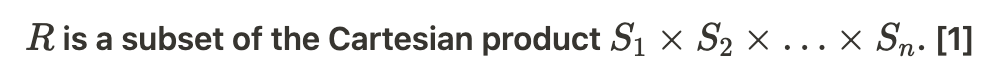
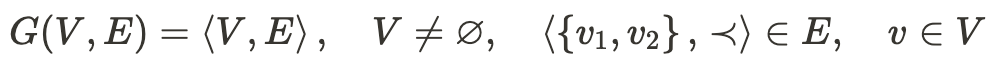
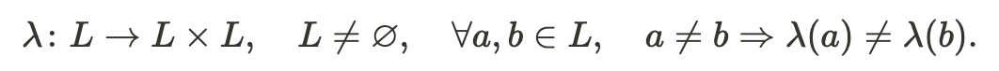
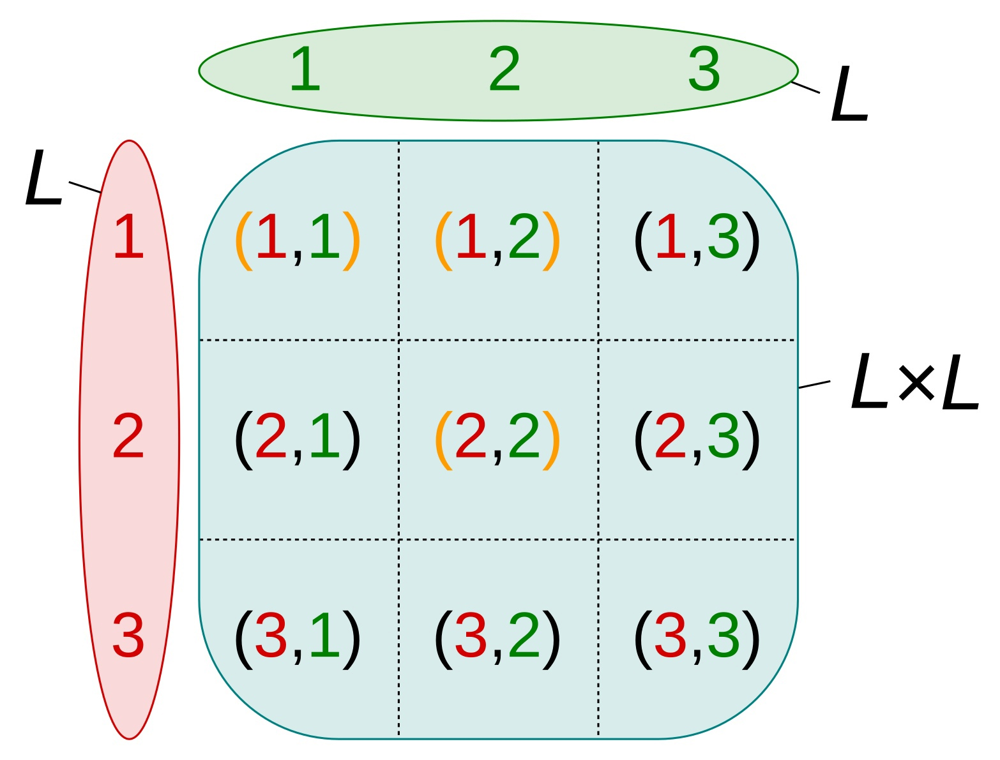
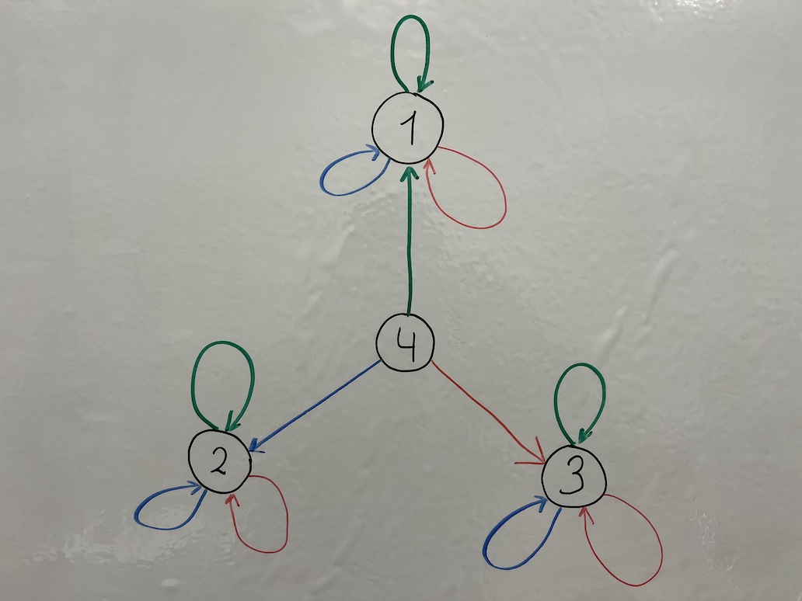

# Math introduction to Deep Theory

**Author:** Ivan Sergeevich Glazunov  
**Published:** April 1, 2022  
**Source:** https://habr.com/en/articles/658705/

---

The article is written as a continuation of the [previous article](https://habr.com/ru/post/656879/).

We will begin to write this article in English, later it can be translated to Russian.

## Introduction

In this article, we would like to compare the core mathematical bases of the two most popular theories and associative theory.

## Relational algebra

Relational algebra and the relational model are based on the concept of relation and n-tuples.

A relation is defined as a set of n-tuples:

$$R \subseteq S_1 \times S_2 \times \ldots \times S_n$$



Where:
- **R** stands for relation (a table);
- **Sn** stands for domain of each column;
- Rows or elements of **R** set are represented as n-tuples.

Data in relational model is grouped into relations. Using n-tuples in a relational model, you can exactly represent any possible data structure. But we are not sure, you need n-tuples for that at all. For example, each n-tuple can be represented as nested ordered pairs (2-tuples). You also don't often see that columns in tables are used as indexes for sequence (n-tuple) elements. In some databases, you're even prohibited to use more than 32 columns in a table and its row (n-tuple). So the N is usually less than 32. So there are no real n-tuples in this case, even in relational databases of today.

## Directed graph definition

Directed graph and graphs in general are based on concepts of vertex and edge (2-tuple).

A directed graph **G** is defined as an ordered pair **G(V, E)**:

$$G = (V, E)$$



Where:
- **V** is a set whose elements are called vertices, nodes, or points;
- **E** is a set of ordered pairs (2-tuples) of vertices, called arcs, directed edges (sometimes simply edges), arrows, or directed lines.

Data in the graph model is represented as a collection of nodes and edges, and you may use this model pretty much for everything, except maybe sequences (n-tuples). Well, perhaps you can represent sequences as sets, but in our point of view it is a messy way to represent sequences. Probably we are not alone and this may be the reason we didn't see other people to do so.

## Associative theory

Associative theory is based on the concept of link.

**A link is defined as n-tuple of references to links.**

### Doublets

Doublet is also known as 2-tuple or ordered pair.

```
L = { 1 , 2 }

L × L = {
  (1, 1),
  (1, 2),
  (2, 1),
  (2, 2),
}
```


Doublets network is defined as:

$$\lambda: L \to L \times L$$


Where:
- **λ** stands for a function that defines a doublets network;
- **L** stands for a set of links indices.

Example:

```
1 → (1,1)
2 → (2,2)
3 → (1,2)
```


*Graph-like graphical representation of the doublets network.*



*This is a graphical representation of Cartesian product, that represents link values. Link values with orange parentheses are selected by the λ function in the example.*

Data in doublets network is represented using doublets (2-tuples).

Doublets can:
- link an object with its properties;
- link two doublets together, something that graph theory does not allow;
- represent any sequence (n-tuple) as a tree built out of nested ordered pairs.

Because of these, doublets can represent any possible data structure.

### Triplets

Triplet is also known as 3-tuple.

```
L = { 1 , 2 }

L × L = {
  (1, 1),
  (1, 2),
  (2, 1),
  (2, 2),
}

L × L × L = {
  (1, 1, 1),
  (1, 1, 2),
  (1, 2, 1),
  (1, 2, 2),
  (2, 1, 1),
  (2, 1, 2),
  (2, 2, 1),
  (2, 2, 2),
}
```


Triplets network is defined as:

$$\lambda: L \to L \times L \times L$$


Where:
- **λ** stands for a function that defines a triplets network;
- **L** stands for a set of links indices.

Example:
```
1 → (1,1,1)
2 → (2,2,2)
3 → (3,3,3)
4 → (1,2,3)
```



*Graph-like graphical representation of the triplets network.*

Data in triplets network is represented using triplets (3-tuples).

Triplets can do everything doublets can, and are especially useful when you need to specify types or values directly for each link.

### Sequences

A sequence is also known as n-tuple.

Links network in general is defined as:

$$\lambda: L \to L^n$$


Where:
- **λ** stands for a function that defines a links network;
- **L** stands for a set of links indices.

Example:
```
1 → (1)
2 → (2,2)
3 → (3,3,3)
4 → (1,2,3,2,1)
```


*This example uses variable length n-tuples for link values.*

Sequences are essentially equivalent in expressive power with relational model. But when you note that doublets and triplets are enough to represent sequences of any size, you may not need to use sequences themselves directly.

## Conclusion


Relation model can represent everything, including associative model. Graph model is particularly good at representing relationships and is not so much in representing sequences.

**Associative model can easily represent n-tuple with unlimited length using tuples with $n \geq 2$, and is as good as graph theory in its ability to represent associations, yet is as powerful as relation model and can fully represent any SQL table.**

There is no need for more than one relation in a relational model to make it behave as an associative model. And in this relation there is no need for more than 2-3 columns except explicit ID or built-in row ID.

Graph model lakes an ability to directly create edge between edges by definition. So graph model is required to either change its definition or to extend it with some additional way to store sequences. It may be actually possible to store sequences as nested sets inside a graph model, but this way isn't popular. Graph model is the closest model to doublets, yet it is still different.

**Using an associative model means you no longer need to choose between SQL and NoSQL databases, you just have associative data storage that can represent everything using the simplest possible way to do so. And you always have your data in the closest possible to original form.**

## References



"Relational Model of Data for Large Shared Data Banks.", paragraph 1.3., Edgar F. Codd, IBM Research Laboratory, San Jose, California, June 1970

---

**Tags:** associativity, deep.foundation, triplets, doublets, links, associative

