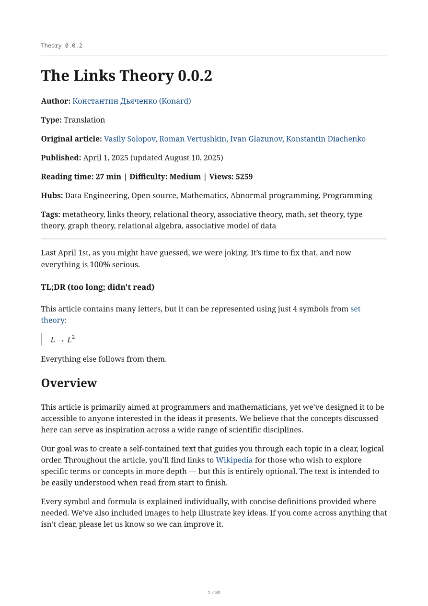
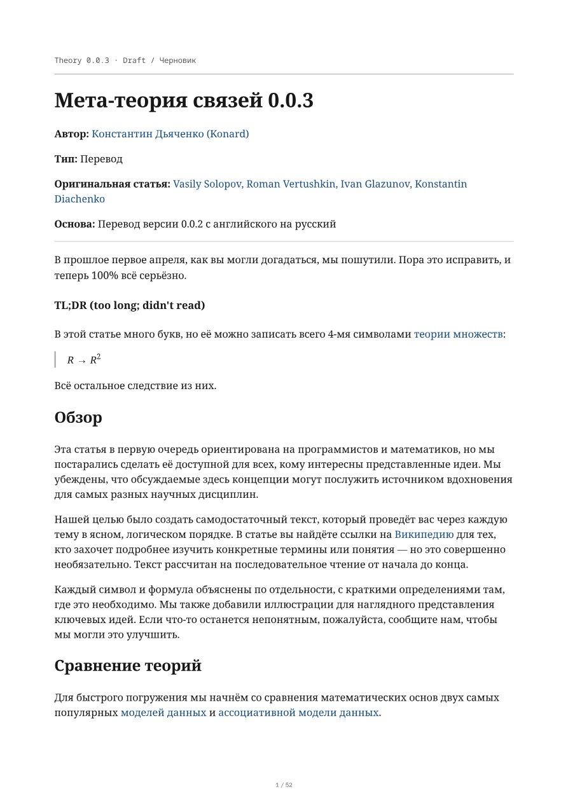
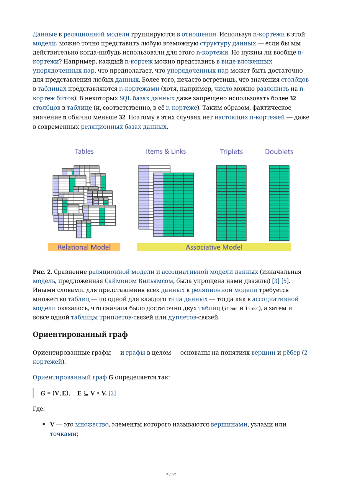

# Issue #59: Markdown PDFs and automatic revisioned releases

Issue: https://github.com/link-foundation/meta-theory/issues/59
Implementation: https://github.com/link-foundation/meta-theory/pull/61
Research and local validation date: 2026-10-05

## Collected evidence

The complete issue is preserved in [research/issue.json](research/issue.json). It has no comments. At the start of this work PR #61 had a placeholder description, no conversation comments, no inline review comments, and no reviews. The repository had no releases or PDF workflow. Its existing workflow checks file sizes and changed Lean/Rocq sources.

The repository contains three complete archived Markdown articles and a Russian 0.0.3 draft split into ten numbered Markdown sections. The draft's `index.md` is a navigation page, not another article chapter. All 48 referenced figures are already stored locally. The articles contain dollar-delimited TeX mathematics, fenced Rocq/Lean code, links, tables, Russian and English text, and relative image paths. Existing downloader and verification code uses a shared article configuration, Playwright, Puppeteer, and ES modules. The PDF implementation follows that script-based structure and discovers draft sources without extending the archived-article downloader to drafts.

Related merged work reviewed:

- [PR #56](https://github.com/link-foundation/meta-theory/pull/56): published web-capture integration and preservation of archive behavior; its description is preserved in [research/pr-56.json](research/pr-56.json).
- [PR #38](https://github.com/link-foundation/meta-theory/pull/38): splitting the draft into sections and formal verification CI; its description is preserved in [research/pr-38.json](research/pr-38.json).

The relevant linksplatform code-search results, scripts, and workflows are preserved under [research/](research/). Irrelevant search hits were excluded. Online primary-source documentation is recorded below so the decisions can be checked independently.

## Every requirement and its solution plan

| Issue requirement | Considered solution and plan | Implemented acceptance check |
| --- | --- | --- |
| Convert Markdown sources to PDF | Evaluate Pandoc/TeX and Chromium; use the existing browser tooling with Markdown parsing and KaTeX, then validate PDF content independently | `npm run build:pdf` builds all four versions; `npm run verify:pdf` reads the PDFs and checks titles, sections, figures, links, and hashes |
| Automatically release `0.0.x.r` versions | Use the highest included theory version as the release prefix and increment a numeric publication revision; serialize publishing | Main-branch workflow publishes `0.0.3.0`, then `0.0.3.1`, etc.; unit tests cover numeric sorting, existing tags, first releases, and retries |
| Always provide the latest PDF of each theory version | Include every theory version in every release and keep asset filenames independent of revision | Stable `releases/latest/download/meta-theory-0.0.x.pdf` links; full-set validation rejects a missing version |
| Make PDFs easy to download, print and read | Add README and release tables, an all-PDF ZIP, A4 layout, embedded figures/fonts, searchable text, page numbers and outline | PDF.js verifies text, figures, links, and ZIP contents; actual PDF pages and a browser preview are saved in [screenshots/](screenshots/) |
| Reuse linksplatform best practices and improve where possible | Study its generators and workflows; retain fail-fast builds, Cyrillic support, fixed filenames and main-only publication; replace mutable downloaded scripts and TeX shell execution with repository code and locked dependencies | Local-only rendering assets, PR build artifacts, read-only build permissions, write permission only on the release job, checksums, draft-first uploads, and retry tests |
| Collect related data in `docs/case-studies/issue-59` | Preserve the issue, relevant related PRs and upstream source snapshots, then record requirements, assumptions, alternative components and results | This case study, [research/](research/), [validation.json](validation.json), and screenshots |
| Search online for additional facts, libraries, solutions and plans | Examine primary documentation for Markdown math, browser PDF options, Pandoc, PDF.js and GitHub publication | Links and comparisons below, with a concrete implementation plan for every requirement in this table |
| Execute everything in one PR | Add builder, tests, complete release workflow, download documentation and evidence on the prepared branch | PR #61 contains the implementation and validation; publication starts after its changes reach `main` |

## Versioning and scope decisions

The issue does not specify whether each theory version needs a separate release or whether one release can contain all PDFs. Separate releases would make GitHub's single `latest` pointer unsuitable for stable links to older theory versions. A complete snapshot release solves both requirements together.

`0.0.x.r` has four numeric components, as requested; it is a document release identifier, not a three-component npm semantic version. `x` is the greatest theory version included in the snapshot; `r` starts at zero and increases for subsequent publications under that prefix. For example, `0.0.3.0` includes `meta-theory-0.0.0.pdf`, `meta-theory-0.0.1.pdf`, `meta-theory-0.0.2.pdf`, and `meta-theory-0.0.3.pdf`. When a 0.0.4 source is added, the next release starts at `0.0.4.0` and still includes older versions.

The unpublished 0.0.3 article is included because it is a theory version in this repository. Its PDF and release row explicitly say “Draft”; that label describes the article, while the GitHub release is published normally so GitHub's latest-download URLs work. Archived Markdown and figures are unchanged. Historical PDF releases are retained.

The scripts package version increases from 1.0.0 to 1.1.0 for the added build/publish commands. This package version is independent of document release identifiers. The new main-push workflow is the release trigger; it needs no manually created tag or npm publication.

## Upstream practices and component comparison

The inspected [linksplatform generator](https://github.com/linksplatform/Scripts/blob/56123b0fa19da3a0a938e386f3037b122d05638a/SingleProjectRepository/generate-pdf.sh) uses `set -e`, installs Cyrillic-capable TeX, performs multiple LaTeX passes, and copies a fixed PDF filename to `_site`. Its C# counterpart does the same for formatted source code. The [Interfaces CD workflow](https://github.com/linksplatform/Interfaces/blob/3dfbee614c1276425f216d032580c052d94da4e8/.github/workflows/CD.yml) generates PDFs and publishes documentation/releases after a push, while tests also run for PRs. These are useful publishing patterns, but their source-code formatting and DocFX steps do not directly convert these Markdown articles.

| Component / route | Advantages | Limitations here | Decision |
| --- | --- | --- | --- |
| linksplatform TeX generator | Existing fail-fast publication convention, fixed filenames, Cyrillic support | Formats code instead of these articles, installs a large TeX stack, downloads mutable scripts, enables TeX shell execution | Reuse its conventions; use a repository-native Markdown builder |
| Pandoc + XeLaTeX/LuaLaTeX | Mature academic typesetting, Unicode-capable engines, TOC and math support | Additional system toolchain and templates; need to adapt the scraped Markdown and browser-oriented figures | Documented alternative if typography later needs TeX-specific features |
| Pandoc + HTML PDF engine | Common converter with several PDF engines | Still introduces Pandoc alongside a browser already present in this repository | Use the Node Markdown parser directly |
| Markdown PDF / md-to-pdf wrappers | Existing Markdown-to-browser-PDF command-line tools | Draft assembly, section links, strict math validation and local assets would still need customization | Use the underlying existing Puppeteer dependency with a small explicit pipeline |
| `markdown-it` + `markdown-it-texmath` + KaTeX | Markdown tables/code plus TeX inside paragraphs, blockquotes and display blocks; renders math without a CDN | texmath catches errors by default; scraper's doubled percent escape needs normalization | Pin dependencies, override math rendering to throw, and test the normalization |
| Puppeteer / Chromium | Already a dependency; print CSS, images/SVG, links, PDF outlines and tagged output | Browser binary installation is required; PDF metadata varies across builds | Use locked Chromium, local fonts and explicit print settings; verify content rather than requiring byte-identical PDFs |
| PDF.js | Reads the actual PDF independently and can render review images | Adds a development dependency and requires current Node 22 | Use for automated validation and reusable preview experiments |
| `fflate` | Small JavaScript ZIP implementation, no additional system executable | Bundling holds this finite PDF set in memory | Store the four PDFs in a checked ZIP; test each member against the individual download |
| GitHub CLI + Actions | Runner-provided authenticated release API, artifacts, permissions and concurrency | Publication is an external integration; must avoid partial latest releases | Mock release operations in tests, upload into a draft, then publish only after success |

Primary documentation consulted online:

- [Pandoc PDF creation](https://pandoc.org/MANUAL.html#creating-a-pdf): supported TeX and HTML PDF engines and font considerations.
- [Puppeteer PDF options](https://pptr.dev/api/puppeteer.pdfoptions): A4, CSS page sizes, backgrounds, page-number footer, outlines, tagged output and font readiness.
- [KaTeX options](https://katex.org/docs/options): strict parse failures and disabled trusted commands.
- [markdown-it-texmath](https://github.com/goessner/markdown-it-texmath): Markdown math inside blockquotes and supported dollar delimiters.
- [Fontsource](https://fontsource.org/docs/getting-started/install): locally hosted fonts, with Latin and Cyrillic subsets used here.
- [PDF.js examples](https://mozilla.github.io/pdf.js/examples/): PDF loading, page text and page rendering.
- [GitHub linking to releases](https://docs.github.com/en/repositories/releasing-projects-on-github/linking-to-releases): latest-release and latest-asset URLs.
- [GitHub concurrency](https://docs.github.com/en/actions/how-tos/write-workflows/choose-when-workflows-run/control-workflow-concurrency): serialize publication without canceling an active upload.

## Implementation and failure handling

1. Discover version directories numerically. Reject duplicate versions and empty version directories. Use one `article.md` or all numbered draft sections, excluding the navigation index.
2. Parse each section separately so its relative assets resolve against its own folder. Embed figures and font files as data URLs. Rewrite links to assembled sections as PDF destinations and other repository links to the exact source commit on GitHub.
3. Render mathematics with parse failures enabled. Normalize only doubled percent escapes inside math tokens; preserve code blocks and source Markdown. The initial renderer silently lost `%` in the repository's `$100\\%$` expressions, reproduced by a failing unit test before the correction.
4. Print with A4 margins, page numbers, Unicode fonts, wrapped code, bounded image size, and PDF outline/tagging. Wait for fonts and image decoding and reject undecodable figures. Abort external browser requests so PDF builds do not depend on external article/asset availability.
5. Produce PDFs, local HTML previews, a ZIP, a source manifest and checksums. Independently read every PDF, count figures and links, verify all section headings and the percentage regression, and check ZIP membership and byte equality.
6. Build and test on every PR. Store the complete output as a review artifact. Publish only for `main`, with write permission confined to the release job. Every main push triggers another snapshot; a manual run on `main` also works. Running for all main changes ensures that the guard against superseded commits cannot skip a document update just because a later documentation-only commit arrived.
7. Select the next revision from all paginated releases and tags using numeric comparisons. The same source SHA resumes its draft or skips an already published release. Check manifest source SHA and all download hashes before making any release changes.
8. Create a draft at the exact source SHA, upload all assets, then publish it as latest. An upload failure leaves a draft and does not change the existing latest release. A workflow for a superseded main commit skips publication so older runs do not replace newer PDFs.

## Reproduction and verification

The feature's initial reproduction was that `npm run build:pdf` did not exist and no GitHub release assets were available. Before implementation, the new tests failed on the missing builder module; the finite baseline output is preserved in [experiments/issue-59/before-implementation.tap](../../../experiments/issue-59/before-implementation.tap).

```bash
npm ci
npx puppeteer browsers install chrome
npm run test:pdf
npm run build:pdf -- --verbose
npm run verify:pdf
(cd dist/pdf && sha256sum -c SHA256SUMS)
node scripts/check-file-size.mjs
npm run test:web-capture
npm test
```

Tests cover numeric version discovery, draft ordering, local SVGs, Cyrillic, inline/display formulas, fenced code, section links, missing/remote figures, invalid TeX, doubled percentage escapes, duplicate/unknown versions, numeric revision allocation and tag collisions, draft-first publication, upload failure, checksum failure, published-release retries, and draft resumption. The real-browser test reads a multi-page PDF and verifies searchable Cyrillic/percent text, reference annotations, outline and ZIP contents.

Local results: all eight PDF tests pass, all four complete PDFs validate, all six download checksums match, file-size checks pass, all 19 web-capture integration checks pass, and `npm test` verifies all three archived articles against Habr. `actionlint` 1.7.7 accepts the new workflow. The local browser setup used installed Chrome for the PDF checks; the normal Playwright article verification also passed after installing its pinned browser.

The additional existing animation quality suite reports 23 passing checks and one pre-existing failure: `scripts/test-capture-quality.mjs:355` expects the literal log phrase `using real capture timestamps`. The unchanged locked web-capture 1.7.6 emits `Real cycle duration: 5010ms` and `Effective capture FPS: ~32.1` instead; capture succeeds with 162 frames. Re-running the same captured output through the unmodified test at main commit `087f4515d0652925eecc54bcade724445c3978f1` reproduces that failure (20 passed, one failed; `--skip-capture` omits the three live-frame checks). Optional video tests are skipped because local ffmpeg is unavailable. The relevant command output is preserved in [capture-baseline.txt](capture-baseline.txt); the reusable baseline probe is [baseline-capture-quality.mjs](../../../experiments/issue-59/baseline-capture-quality.mjs). Neither capture code nor its dependency version changes in this PR.

The complete document validation is recorded in [validation.json](validation.json):

| Theory | Pages | Figures | Clickable links | Source sections |
| --- | ---: | ---: | ---: | ---: |
| 0.0.0 | 11 | 12 | 19 | 1 |
| 0.0.1 | 28 | 10 | 70 | 1 |
| 0.0.2 | 30 | 13 | 164 | 1 |
| 0.0.3 | 52 | 13 | 227 | 10 |

The Playwright browser inspection of the 0.0.3 preview found 13 loaded images, 159 rendered formulas, all 10 sections, and no overflowing code/math/images. The only console error was the preview server's missing favicon, which is unrelated to PDF content. The PDF page renders below were checked for Cyrillic, the restored percentage, formulas, figures and page numbers.





Reusable experiments are in [experiments/issue-59/](../../../experiments/issue-59/). `render-preview.mjs` renders the actual PDFs. `use-system-browser.mjs` runs existing Playwright checks with an installed compatible Chrome when local browser downloads cannot finish; the original article verification was also executed without modifying archive sources. Verbose local command logs are retained there and ignored by Git.

## Limits and future extension

The first public download links activate when this PR's workflow reaches `main`; a PR intentionally produces review artifacts instead of public releases. Publication operations are tested with a mocked GitHub CLI because publishing from a PR would bypass that workflow boundary. GitHub Actions validates the full rendering pipeline before publishing on main.

The release revision captures the whole repository's theory snapshot rather than allocating a separate tag for each article. PDF bytes can differ because Chromium embeds creation metadata; hashes authenticate a particular download, not a promise of binary reproducibility. Tagged output and outlines improve navigation, but this work does not claim a complete PDF/UA accessibility audit.

Future numbered draft sections and `0.0.x` directories are discovered automatically. Adding another language variant within the same version would require an explicit language-aware asset naming scheme. Print CSS and source paths remain small, reviewable repository files so typography can evolve without replacing the download URLs or archived articles.
