# Мета-теория связей 0.0.3

**Автор:** [Константин Дьяченко (Konard)](https://habr.com/ru/users/Konard/)

**Тип:** Перевод

**Оригинальная статья:** [Vasily Solopov, Roman Vertushkin, Ivan Glazunov, Konstantin Diachenko](https://habr.com/en/articles/895896)

**Основа:** Перевод версии 0.0.2 с английского на русский

---

В прошлое первое апреля, как вы могли догадаться, мы пошутили. Пора это исправить, и теперь $100\\%$ всё серьёзно.

#### TL;DR (too long; didn't read)

В этой статье много букв, но её можно записать всего 4-мя символами [теории множеств](https://ru.wikipedia.org/wiki/Теория_множеств):

> $\displaystyle L \to L^2$

Всё остальное следствие из них.

## Обзор

Эта статья в первую очередь ориентирована на программистов и математиков, но мы постарались сделать её доступной для всех, кому интересны представленные идеи. Мы убеждены, что обсуждаемые здесь концепции могут послужить источником вдохновения для самых разных научных дисциплин.

Нашей целью было создать самодостаточный текст, который проведёт вас через каждую тему в ясном, логическом порядке. В статье вы найдёте ссылки на [Википедию](https://www.wikipedia.org) для тех, кто захочет подробнее изучить конкретные термины или понятия — но это совершенно необязательно. Текст рассчитан на последовательное чтение от начала до конца.

Каждый символ и формула объяснены по отдельности, с краткими определениями там, где это необходимо. Мы также добавили иллюстрации для наглядного представления ключевых идей. Если что-то останется непонятным, пожалуйста, сообщите нам, чтобы мы могли это улучшить.

## Сравнение теорий

Для быстрого погружения мы начнём со сравнения математических основ двух самых популярных [моделей данных](https://ru.wikipedia.org/wiki/Модель_данных) и [ассоциативной модели данных](https://web.archive.org/web/20210814063207/https://en.wikipedia.org/wiki/Associative_model_of_data).

В ходе нашего исследования мы обнаружили, что традиционные теории иногда оказывались чрезмерно сложными или избыточными, а иногда накладывали слишком много искусственных ограничений.

Этот общий недостаток гибкости, адаптивности и универсальности побудил нас искать более простую, но всеобъемлющую информационную теорию и модель хранения данных, которую будущий искусственный интеллект сможет легко понять и эффективно использовать. По пути мы черпали вдохновение из работы нашей собственной ассоциативной памяти и ассоциативных мыслительных процессов.

### Реляционная алгебра

[Реляционная алгебра](https://ru.wikipedia.org/wiki/Реляционная_алгебра) и [реляционная модель](https://ru.wikipedia.org/wiki/Реляционная_модель_данных) основаны на понятиях [отношения](https://en.wikipedia.org/wiki/Relation_(database)) и [n-кортежей](https://ru.wikipedia.org/wiki/Кортеж_(информатика)).

[Отношение](https://en.wikipedia.org/wiki/Relation_(database)) определяется как [множество](https://ru.wikipedia.org/wiki/Множество) [n-кортежей](https://ru.wikipedia.org/wiki/Кортеж_(информатика)):

> $\mathbf{R \subseteq S_1 \times S_2 \times \dots \times S_n.}$ [[1]](https://dl.acm.org/doi/abs/10.1145/362384.362685)

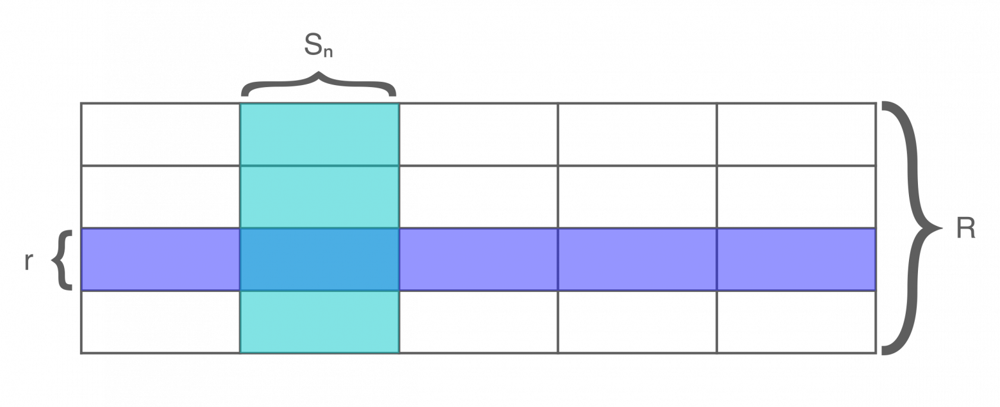

**Рис. 1.** Таблица описывается [отношением](https://en.wikipedia.org/wiki/Relation_(database)) $\mathbf{R}$, которое представляется [множеством](https://ru.wikipedia.org/wiki/Множество) [строк](https://en.wikipedia.org/wiki/Row_(database)) $\mathbf{r}$, принадлежащих [декартову произведению](https://ru.wikipedia.org/wiki/Декартово_произведение) $\mathbf{S_1 \times S_2 \times \dots \times S_n}$.

**Где:**

- [Символ](https://ru.wikipedia.org/wiki/Таблица_математических_символов) $\mathbf{R}$ обозначает [отношение](https://en.wikipedia.org/wiki/Relation_(mathematics)) ([таблицу](https://en.wikipedia.org/wiki/Table_(database)));
- [Символ](https://ru.wikipedia.org/wiki/Таблица_математических_символов) $\subseteq$ обозначает, что левая часть [выражения](https://ru.wikipedia.org/wiki/Выражение_(математика)) является [подмножеством](https://ru.wikipedia.org/wiki/Подмножество) правой части;
- [Символ](https://ru.wikipedia.org/wiki/Таблица_математических_символов) $\times$ обозначает [декартово произведение](https://ru.wikipedia.org/wiki/Декартово_произведение) двух [множеств](https://ru.wikipedia.org/wiki/Множество);
- [Выражение](https://ru.wikipedia.org/wiki/Выражение_(математика)) $\mathbf{S_n}$ обозначает [домен](https://en.wikipedia.org/wiki/Data_domain), то есть [множество](https://ru.wikipedia.org/wiki/Множество) всех возможных [значений](https://ru.wikipedia.org/wiki/Значение_(информатика)), которые может содержать каждая ячейка в [столбце](https://en.wikipedia.org/wiki/Table_(database)).

[Строки](https://en.wikipedia.org/wiki/Row_(database)), или [элементы](https://ru.wikipedia.org/wiki/Элемент_(математика)) [отношения](https://en.wikipedia.org/wiki/Relation_(database)) $\mathbf{R}$, представлены в виде [n-кортежей](https://ru.wikipedia.org/wiki/Кортеж_(информатика)).

[Данные](https://ru.wikipedia.org/wiki/Данные) в [реляционной модели](https://ru.wikipedia.org/wiki/Реляционная_модель_данных) группируются в [отношения](https://en.wikipedia.org/wiki/Relation_(database)). Используя [n-кортежи](https://ru.wikipedia.org/wiki/Кортеж_(информатика)) в этой [модели](https://en.wikipedia.org/wiki/Database_model), можно точно представить любую возможную [структуру данных](https://ru.wikipedia.org/wiki/Структура_данных) — если бы мы действительно когда-нибудь использовали для этого [n-кортежи](https://ru.wikipedia.org/wiki/Кортеж_(информатика)). Но нужны ли вообще [n-кортежи](https://ru.wikipedia.org/wiki/Кортеж_(информатика))? Например, каждый [n-кортеж](https://ru.wikipedia.org/wiki/Кортеж_(информатика)) можно представить [в виде вложенных упорядоченных пар](https://en.wikipedia.org/wiki/Tuple#Tuples_as_nested_ordered_pairs), что предполагает, что [упорядоченных пар](https://ru.wikipedia.org/wiki/Упорядоченная_пара) может быть достаточно для представления любых [данных](https://ru.wikipedia.org/wiki/Данные). Более того, нечасто встретишь, что значения [столбцов](https://en.wikipedia.org/wiki/Table_(database)) в [таблицах](https://en.wikipedia.org/wiki/Table_(database)) представляются [n-кортежами](https://ru.wikipedia.org/wiki/Кортеж_(информатика)) (хотя, например, [число](https://ru.wikipedia.org/wiki/Число) можно [разложить](https://en.wikipedia.org/wiki/Decomposition_(computer_science)) на [n-кортеж](https://ru.wikipedia.org/wiki/Кортеж_(информатика)) [битов](https://ru.wikipedia.org/wiki/Бит)). В некоторых [SQL](https://ru.wikipedia.org/wiki/SQL) [базах данных](https://ru.wikipedia.org/wiki/База_данных) даже запрещено использовать более $\mathbf{32}$ [столбцов](https://en.wikipedia.org/wiki/Table_(database)) в [таблице](https://en.wikipedia.org/wiki/Table_(database)) (и, соответственно, в её [n-кортеже](https://ru.wikipedia.org/wiki/Кортеж_(информатика))). Таким образом, фактическое значение $\mathbf{n}$ обычно меньше $\mathbf{32}$. Поэтому в этих случаях нет [настоящих](https://ru.wikipedia.org/wiki/Истина) [n-кортежей](https://ru.wikipedia.org/wiki/Кортеж_(информатика)) — даже в современных [реляционных](https://ru.wikipedia.org/wiki/Реляционная_модель_данных) [базах данных](https://ru.wikipedia.org/wiki/База_данных).

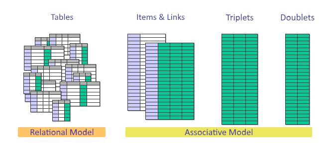

**Рис. 2.** Сравнение [реляционной модели](https://ru.wikipedia.org/wiki/Реляционная_модель_данных) и [ассоциативной модели данных](http://iacis.org/iis/2009/P2009_1301.pdf) (изначальная [модель](https://en.wikipedia.org/wiki/Data_model), предложенная [Саймоном Вильямсом](https://www.linkedin.com/in/s1m0n), была упрощена нами дважды) [[3]](https://web.archive.org/web/20181219134621/http://sentences.com/docs/amd.pdf). Иными словами, для представления всех [данных](https://ru.wikipedia.org/wiki/Данные) в [реляционной модели](https://ru.wikipedia.org/wiki/Реляционная_модель_данных) требуется множество [таблиц](https://en.wikipedia.org/wiki/Table_(database)) — по одной для каждого [типа данных](https://ru.wikipedia.org/wiki/Тип_данных) — тогда как в [ассоциативной модели](https://web.archive.org/web/20210814063207/https://en.wikipedia.org/wiki/Associative_model_of_data) оказалось, что сначала было достаточно двух [таблиц](https://en.wikipedia.org/wiki/Table_(database)) (`items` и `links`), а затем и вовсе одной [таблицы](https://en.wikipedia.org/wiki/Table_(database)) [триплетов](https://ru.wikipedia.org/wiki/Кортеж_(информатика))-связей или [дуплетов](https://ru.wikipedia.org/wiki/Упорядоченная_пара)-связей.

### Ориентированный граф

Ориентированные графы — и [графы](https://ru.wikipedia.org/wiki/Теория_графов) в целом — основаны на понятиях [вершин](https://ru.wikipedia.org/wiki/Вершина_(теория_графов)) и [рёбер](https://ru.wikipedia.org/wiki/Ребро_(теория_графов)) ([2-кортежей](https://ru.wikipedia.org/wiki/Упорядоченная_пара)).

[Ориентированный граф](https://ru.wikipedia.org/wiki/Ориентированный_граф) $\mathbf{G}$ определяется так:

> $\mathbf{G = (V, E), \quad E \subseteq V \times V.}$ [[2]](https://books.google.com/books?id=vaXv_yhefG8C)

Где:

- $\mathbf{V}$ — это [множество](https://ru.wikipedia.org/wiki/Множество), элементы которого называются [вершинами](https://ru.wikipedia.org/wiki/Вершина_(теория_графов)), узлами или [точками](https://ru.wikipedia.org/wiki/Точка_(геометрия));
- $\mathbf{E}$ — это множество [упорядоченных пар](https://ru.wikipedia.org/wiki/Упорядоченная_пара) (2-[кортежей](https://ru.wikipedia.org/wiki/Кортеж_(информатика))) [вершин](https://ru.wikipedia.org/wiki/Вершина_(теория_графов)), называемых дугами, направленными [рёбрами](https://ru.wikipedia.org/wiki/Ребро_(теория_графов)) (иногда просто [рёбрами](https://ru.wikipedia.org/wiki/Ребро_(теория_графов))), стрелками или направленными [отрезками](https://ru.wikipedia.org/wiki/Отрезок).

В модели ориентированного графа данные представлены двумя отдельными [множествами](https://ru.wikipedia.org/wiki/Множество): [узлами](https://ru.wikipedia.org/wiki/Вершина_(теория_графов)) и [рёбрами](https://ru.wikipedia.org/wiki/Ребро_(теория_графов)). Эту [модель](https://en.wikipedia.org/wiki/Data_model) можно использовать для представления почти всех [структур данных](https://ru.wikipedia.org/wiki/Структура_данных), кроме, вероятно, [последовательностей](https://ru.wikipedia.org/wiki/Последовательность) ([n-кортежей](https://ru.wikipedia.org/wiki/Кортеж_(информатика))). Иногда можно встретить, что используются цепочки вершин как представления последовательностей. И хотя этот метод работает, он гарантированно приводит к дупликации данных, а дедупликация в этом случае будет осложнена или недоступна. Ещё, вероятно, последовательности в графах можно представить, используя [разложение последовательности на вложенные множества](https://en.wikipedia.org/wiki/Tuple#Tuples_as_nested_sets), но, на наш взгляд, это непрактичный способ. Вероятно, не одни мы так считаем, что может объяснить, почему мы не встретили примеров использования такого метода другими людьми.

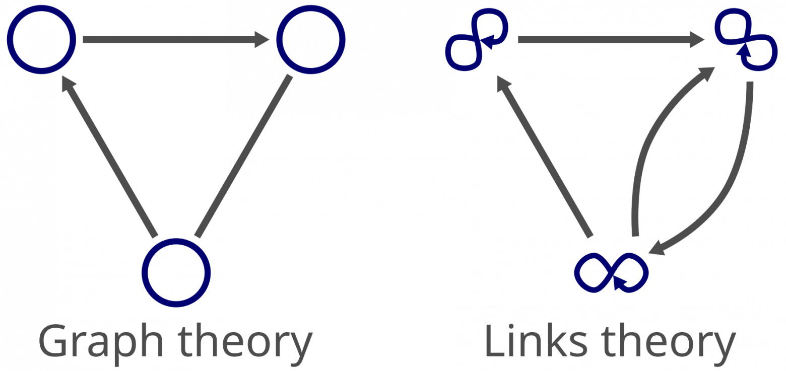

**Рис. 3.** Сравнение теории графов и теории связей. Вершина эквивалентна [замкнутой на себя связи](https://linksplatform.github.io/itself.html) — связи, которая в себе начинается и в себе заканчивается. Направленное ребро отображается в направленную связь-дуплет, а ненаправленное ребро — в пару направленных связей-дуплетов в обоих противоположных направлениях. Иными словами, если в теории графов требуется два типа сущностей — вершины и рёбра, то в теории связей достаточно только связей (больше всего похожих на рёбра).

### Теория связей

Теория связей основана на понятии связи.

В проекции теории связей в теорию множеств [связь](https://habr.com/ru/companies/deepfoundation/articles/576398) определяется как [n-кортеж](https://ru.wikipedia.org/wiki/Кортеж_(информатика)) ссылок на связи, у которой есть собственная ссылка, используя которую другие связи могут ссылаться на неё.

> Стоит отметить, что отдельное понятие ссылки здесь требуется только потому, что [рекурсивные определения](https://ru.wikipedia.org/wiki/Определение#Виды_определений) недоступны в теории множеств. Сама же теория связей может описать себя без необходимости отдельного термина ссылки — то есть ссылка это частный случай связи.

#### Дуплеты

Связь-дуплет представлена дуплетом (2-кортежем или [упорядоченной парой](https://ru.wikipedia.org/wiki/Упорядоченная_пара)) ссылок на связи. У связи-дуплета есть собственная ссылка.

```python
L = { 1 , 2 }

L × L = {
  (1, 1),
  (1, 2),
  (2, 1),
  (2, 2),
}
```

**Где:**

- $L$ — это множество ссылок (от английского слова «Links» — ссылки).

В этом примере в множестве $L$ всего $2$ ссылки на связи, а именно $1$ и $2$. Иными словами, в сети связей, построенной на таком множестве ссылок, может быть только $2$ связи.

Чтобы получить все возможные значения связи, используется [декартово произведение](https://ru.wikipedia.org/wiki/Декартово_произведение) $L$ на само себя, то есть $L \times L$.

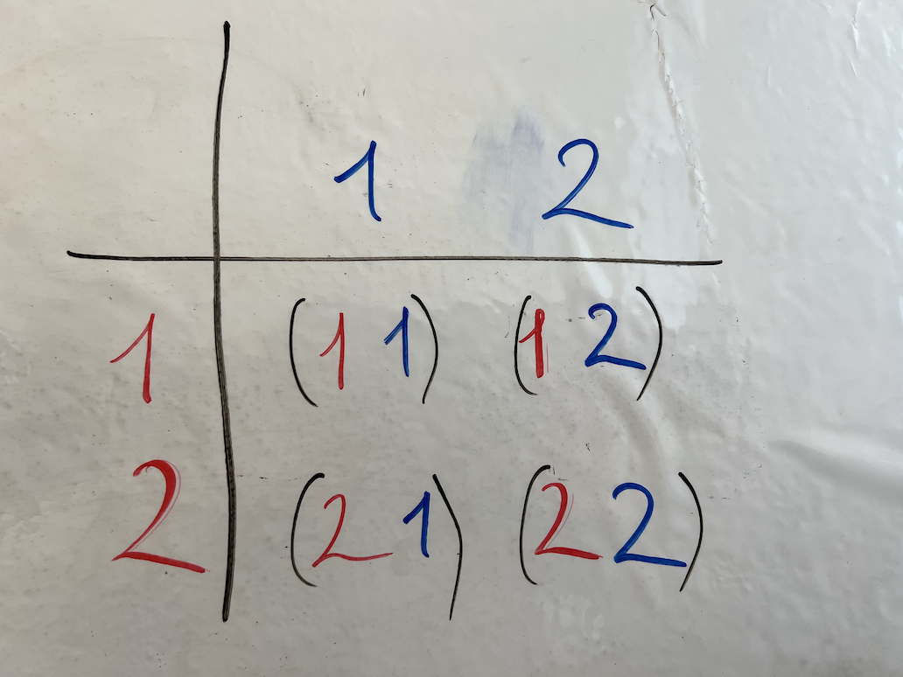

**Рис. 4.** Матрица, представляющая декартово произведение множества {1, 2} на само себя. Здесь мы видим, что у связей с двумя ссылками на связи может быть всего 4 возможных значения.

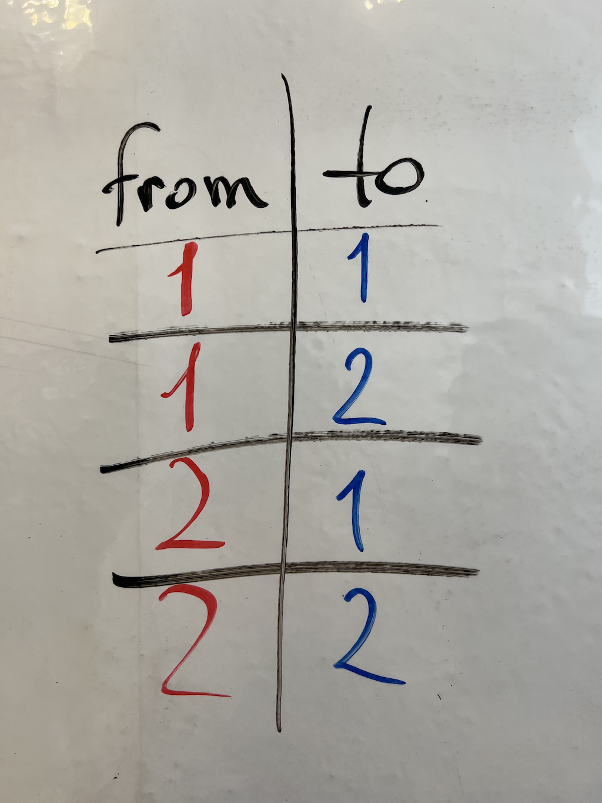

**Рис. 5.** Таблица строк, содержащих все возможные варианты значений связей для сети с двумя связями; эти варианты получаются при помощи декартова произведения {1, 2} на само себя.

**Сеть связей-дуплетов** определяется как:

> $\displaystyle \mathbf{\lambda: L \to L \times L}$

Где:

- $\to$ обозначает [отображение (функцию)](https://ru.wikipedia.org/wiki/Функция_(математика));
- $\mathbf{\lambda}$ обозначает функцию, определяющую сеть дуплетов;
- $\mathbf{L}$ обозначает множество ссылок на связи.

**Пример:**

> $\displaystyle 1 \to (1, 1)$
>
> $\displaystyle 2 \to (2, 2)$
>
> $\displaystyle \mathbf{3 \to (1, 2)}$

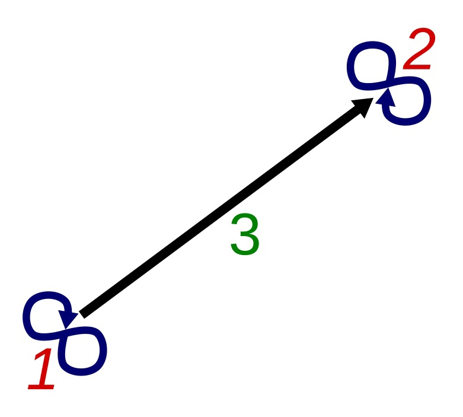

**Рис. 6. Сеть из трёх связей.** Представление сети дуплетов похоже на граф, но такую визуализацию мы называем сетью связей. Первая и вторая связи имеют похожую структуру — обе начинаются в себе и заканчиваются в себе. Отсюда получается, что вместо традиционного представления вершины в виде точки в теории графов мы получаем графическое представление замкнутой самоссылочной стрелки, которое похоже на символ бесконечности.

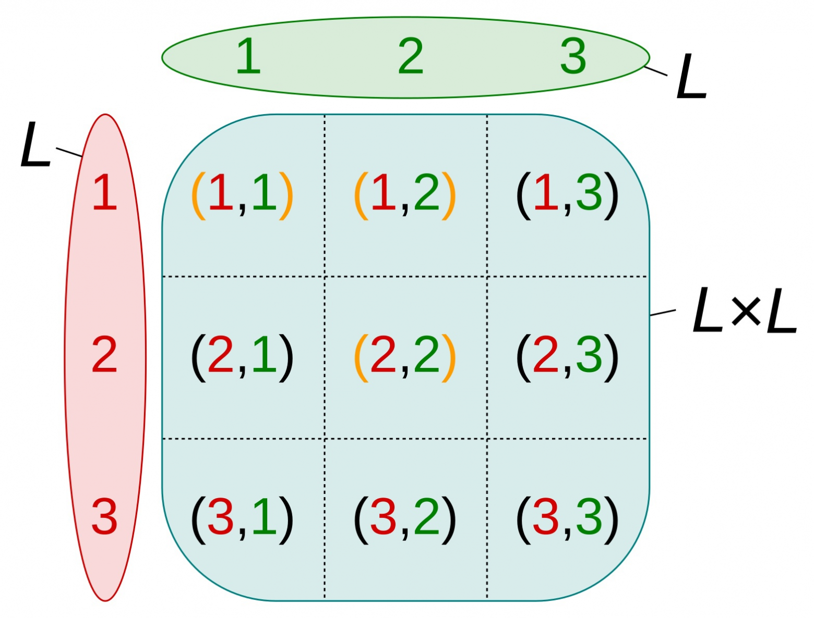

**Рис. 7.** Это графическое представление декартова произведения в виде матрицы, которое отображает все возможные значения связей. Связи, определяющие конкретную сеть, выделены оранжевым цветом. Иными словами, из 9 возможных вариантов значений связи выбраны всего 3 связи, что соответствует размеру множества **L**.

Сеть связей-дуплетов может представлять любую структуру данных.

Например, связи-дуплеты могут:

- связывать объект с его свойствами;
- связывать два дуплета вместе, чего определение теории графов не позволяет;
- представлять любую последовательность (n-кортеж) в виде дерева, построенного из вложенных упорядоченных пар;
- описать предложение на естественном языке, например, по модели [подлежащее-сказуемое](https://ru.wikipedia.org/wiki/Сказуемое).

Благодаря этому и другим фактам мы убеждены, что связи-дуплеты могут представлять любую возможную структуру данных.

#### Триплеты

Связь-триплет представлена триплетом (3-кортежем) ссылок на связи.

```python
L = { 1 , 2 }

L × L = {
  (1, 1),
  (1, 2),
  (2, 1),
  (2, 2),
}

L × L × L = {
  (1, 1, 1),
  (1, 1, 2),
  (1, 2, 1),
  (1, 2, 2),
  (2, 1, 1),
  (2, 1, 2),
  (2, 2, 1),
  (2, 2, 2),
}
```

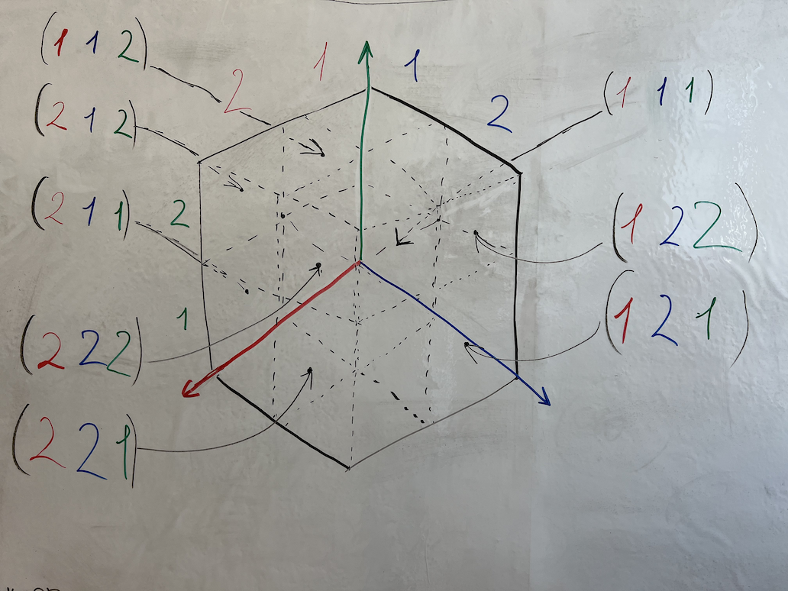

**Рис. 8.** Трёхмерный куб-матрица, который представляет все возможные значения связи-триплета. Такой куб получается рекурсивным декартовым произведением множества {1, 2} на само себя, то есть { 1, 2 } × { 1, 2 } × { 1, 2 }.

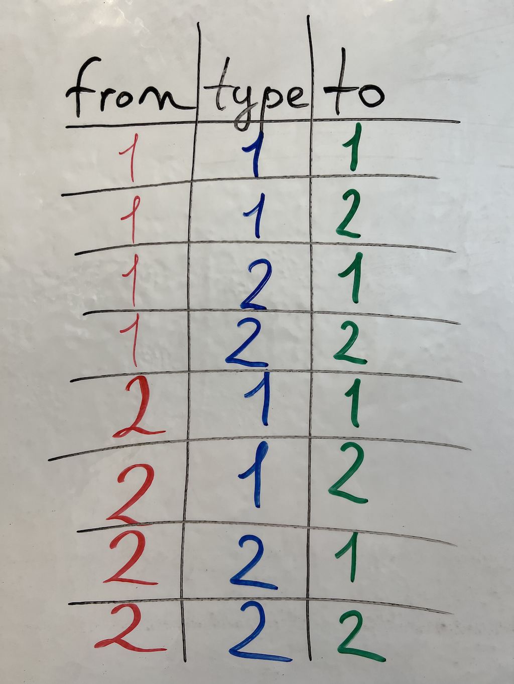

**Рис. 9.** Таблица всех возможных вариантов значений связи-триплета, получаемая рекурсивным декартовым произведением множества { 1, 2 } на само себя, то есть { 1, 2 } × { 1, 2 } × { 1, 2 }. **Примечание:** первая ссылка может интерпретироваться как начало, вторая как тип, а третья как конец; пользователь сам определяет, как интерпретировать компоненты вектора ссылок в соответствии с решаемой задачей.

**Сеть связей-триплетов** определяется как:

> $\displaystyle \mathbf{\lambda : L \to L \times L \times L}$

Где:

- $\mathbf{\lambda}$ обозначает функцию, определяющую сеть триплетов;
- $\mathbf{L}$ обозначает множество ссылок на связи.

Пример функции, задающей конкретную сеть триплетов:

> $\displaystyle 1 \to (1, 1, 1)$
>
> $\displaystyle 2 \to (2, 2, 2)$
>
> $\displaystyle 3 \to (3, 3, 3)$
>
> $\displaystyle \mathbf{4 \to (1, 2, 3)}$

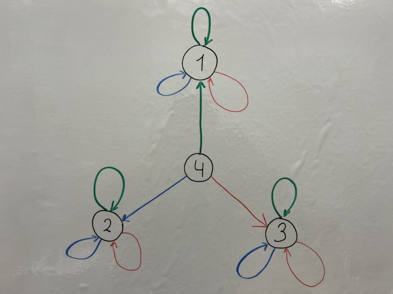

**Рис. 10.** Ассоциативная сеть триплетов, представленная в виде цветного ориентированного графа. В этой ассоциативной сети 4 триплета, соответствующие функции, заданной выше. Узлы соответствуют связям, а цвета рёбер соответствуют ссылкам на связи в соответствии с Рис. 9 (красный — from, синий — type, зелёный — to).

Связи-триплеты могут делать то же, что и связи-дуплеты. Поскольку в триплетах есть дополнительная ссылка, её можно, например, использовать для указания типа связи.

Например, связи-триплеты могут:

- связывать объект, его свойство и значение;
- связывать две связи вместе определённым отношением;
- описать предложение на естественном языке, например, по модели [подлежащее-глагол-дополнение](https://ru.wikipedia.org/wiki/Порядок_слов_в_предложении).

#### Последовательности

Последовательность ссылок на связи — также известная как [n-кортеж](https://ru.wikipedia.org/wiki/Кортеж_(информатика)) — является общим случаем.

В общем виде сеть связей определяется как:

> $\displaystyle \mathbf{\lambda : L \rightarrow \underbrace{ L \times L \times \ldots \times L}_{n}}$

Где:

- $\mathbf{\lambda}$ обозначает функцию, определяющую сеть связей;
- $\mathbf{L}$ обозначает множество ссылок на связи.

Пример:

> $\displaystyle 1 \to (1)$
>
> $\displaystyle 2 \to (2, 2)$
>
> $\displaystyle 3 \to (3, 3, 3)$
>
> $\displaystyle \mathbf{4 \to (1, 2, 3, 2, 1)}$

В этом примере используются n-кортежи переменной длины в качестве значений связей.

Последовательности (вектора) по сути эквивалентны по выразительной силе реляционной модели — факт, который ещё предстоит доказать в рамках разрабатываемой теории. Однако, когда мы заметили, что связей-дуплетов и связей-триплетов достаточно для представления последовательностей любого размера, появилось предположение об отсутствии необходимости использовать последовательности напрямую, поскольку они представимы связями-дуплетами.

### Итоги сравнения

[Реляционная модель данных](https://ru.wikipedia.org/wiki/Реляционная_модель_данных) может представить всё — включая [ассоциативную модель](https://web.archive.org/web/20210814063207/https://en.wikipedia.org/wiki/Associative_model_of_data), но для этого необходимо ввести [отношение порядка](https://ru.wikipedia.org/wiki/Отношение_порядка), которое обычно принимает форму отдельного столбца ID. Это связано с тем, что реляционная модель данных основана на понятии [множества](https://ru.wikipedia.org/wiki/Множество), а не [последовательности](https://ru.wikipedia.org/wiki/Последовательность). В противоположность этому, графовая модель отлично представляет отношения, но менее эффективна в представлении уникальных дедуплицированных последовательностей.

Хотя сама реляционная модель не требует разделения данных на несколько таблиц, традиционные реализации обычно принимают такой подход с фиксированными схемами, что приводит к фрагментации связанных данных и усложняет восстановление заложенных связей. В противоположность этому, ассоциативная модель использует единое хранилище связей, которое достигает максимально возможной степени нормализации. Такая архитектура упрощает взаимно-однозначное отображение предметной области, тем самым облегчая быстрые изменения требований [[4]](https://www.researchgate.net/publication/255670856_A_COMPARISON_OF_THE_RELATIONAL_DATABASE_MODEL_AND_THE_ASSOCIATIVE_DATABASE_MODEL).

Ассоциативная модель может легко представить n-кортежи неограниченной длины, используя кортежи с $\mathbf{n \geq 2}$. Она столь же хороша, как теория графов, в своей способности представлять ассоциации, и столь же мощна, как реляционная модель, способная полностью представить любую таблицу SQL. Кроме того, ассоциативная модель может представлять строгие последовательности, позволяя инкапсулировать любую последовательность в единственную уникальную связь, что полезно для дедупликации.

В реляционной модели достаточно всего одного отношения, чтобы воспроизвести поведение ассоциативной модели, и обычно при этом нужно не более 2–3 столбцов помимо явного ID или встроенного ID строки. Сам ID требуется в реляционной модели, поскольку она построена на понятии множества; в противоположность этому теория связей построена на понятии последовательности, поэтому явный ID не требуется (и может быть добавлен опционально, если пользователь действительно в нём нуждается).

По определению графовая модель не может напрямую создать ребро между рёбрами. Поэтому ей потребуется либо переопределение, либо расширение с помощью однозначного метода хранения уникальных дедуплицированных последовательностей. Хотя последовательности можно хранить [в виде вложенных множеств](https://en.wikipedia.org/wiki/Tuple#Tuples_as_nested_sets) внутри графовой модели, этот подход не популярен. Несмотря на то что графовая модель наиболее близка к связям-дуплетам, она всё же отличается по определению.

Использование ассоциативной модели означает, что больше не нужно выбирать между SQL и NoSQL базами данных; вместо этого ассоциативное хранилище данных может представить всё самым простым возможным способом, при этом данные всегда находятся в наиболее близкой к оригиналу форме (обычно это нормализованная форма, но денормализация тоже возможна при необходимости).

## Математическое введение в теорию связей

### Введение

Теперь, когда мы кратко представили истоки нашей работы, настала пора погрузиться в теорию ещё глубже.

> Теория связей разрабатывается как более фундаментальная теория по сравнению с теорией множеств и теорией типов, и как замена реляционной алгебре и теории графов в качестве объединяющей теории. В то время как теория типов построена на базовых понятиях «тип» и «терм», а теория множеств — на «множестве» и «элементе», теория связей сводит всё к единому понятию «связь».

В этом разделе мы разберём основные понятия и термины, используемые в теории связей.

Затем мы представим определения теории связей в рамках теории множеств и впоследствии спроецируем эти определения в теорию типов, используя интерактивное средство доказательства теорем Rocq.

Наконец, мы подведём итоги и наметим направления дальнейших исследований и развития теории связей.

#### Теория связей

В основе всей теории связей лежит единое понятие связи. Дополнительное понятие ссылки на связь вводится только для теорий, не поддерживающих рекурсивные определения, — таких как теория множеств и теория типов.

#### Связь

Связь обладает асимметричной рекурсивной (фрактальной) структурой, которая может быть выражена просто: связь **связывает** связи (как в «связь **соединяет** связи»). Под «асимметричностью» подразумевается то, что каждая связь имеет направление — от источника (начала) к приёмнику (концу).

### Определения теории связей в рамках теории множеств

**Ссылка на вектор** — это уникальный идентификатор или порядковый номер, который связан с определённым вектором, представляющим последовательность ссылок на другие вектора.

Множество ссылок на вектора:

> $\displaystyle \mathbf{L ⊆ ℕ_0}$

**Вектор ссылок** — это вектор, состоящий из нуля или более ссылок на вектора, где количество ссылок соответствует количеству элементов вектора.

Множество всех векторов ссылок длины $n ∈ ℕ_0$:

> $\displaystyle \mathbf{V_n = L^n}$

Декартова степень $L^n$ всегда даёт вектор длины $n$, так как все его компоненты одного и того же типа $L$.
Другими словами, $L^n$ представляет собой множество всех возможных n-элементных векторов (по сути n-кортежей), где каждый элемент принадлежит множеству $L$.

**Ассоциация** — это упорядоченная пара, состоящая из ссылки на вектор и вектора ссылок. Эта структура служит для отображения между ссылками и векторами.

> $\displaystyle \mathbf{A = L \times V_n}$

**Ассоциативная сеть векторов длины n** (или n-мерная ассоциативная сеть) определяется семейством функций $\{anetv^n\}$, где каждая функция $anetv^n: L → V_n$ отображает ссылку $l ∈ L$ в вектор ссылок длины $n$, принадлежащий $V_n$, тем самым идентифицируя точки в n-мерном пространстве.
$n$ в $anetv^n$ указывает на то, что функция возвращает вектора, содержащие $n$ ссылок. Каждая n-мерная ассоциативная сеть таким образом представляет последовательность точек в n-мерном пространстве.

**Семейство функций:**

> $\displaystyle \mathbf{∪_f \{anetv^n | n ∈ ℕ_0\} ⊆ A}$

Здесь символ объединения $∪_f$ обозначает агрегацию всех функций в семействе $\{anetv^n\}$, а символ $⊆$ указывает на то, что эти упорядоченные пары — рассматриваемые как функциональные бинарные отношения — являются подмножеством множества $A$ всех ассоциаций.

**Множество дуплетов (упорядоченных пар или двумерных векторов) ссылок:**

> $\displaystyle \mathbf{D = L^2}$

Это множество всех дуплетов $(L, L)$, то есть вторая декартова степень $L$.

**Ассоциативная сеть дуплетов (или двумерная ассоциативная сеть):**

> $\displaystyle \mathbf{anetd: L → L^2}$

Каждая ассоциативная сеть дуплетов таким образом представляет последовательность точек в двумерном пространстве.

Пустой вектор (вектор длины ноль) представлен пустым кортежем, обозначаемым как $()$ или $∅$.

**Ассоциативная сеть вложенных упорядоченных пар:**

> $\displaystyle \mathbf{anetl: L → NP}\textbf{, где }\mathbf{NP = \{(∅, ∅) | (l, np), l ∈ L, np ∈ NP\} }$

$NP$ — это множество вложенных упорядоченных пар, состоящее из пустых пар и пар, содержащих один или более элементов. Таким образом, вектор длины $n \in \mathbb{N}_0$ может быть представлен как вложенные упорядоченные пары.

### Проекция теории связей в теорию типов (Rocq) через теорию множеств

#### О Rocq

[Rocq](https://rocq-prover.org/) (ранее известный как [Coq](https://ru.wikipedia.org/wiki/Coq)) — это интерактивное средство доказательства теорем, основанное на теории типов высшего порядка, также известной как Исчисление Индуктивных Построений (Calculus of Inductive Constructions, CIC). Это мощная среда для формализации сложных математических теорем, проверки доказательств на корректность и извлечения работающего программного кода из формально проверенных спецификаций. Rocq широко используется в академических кругах для формализации математики, а также в IT-индустрии для верификации программного обеспечения и оборудования.

> В 2024 году проект Coq был [переименован в Rocq](https://rocq-prover.org/). Все ссылки на документацию и исходный код в данной статье используют актуальное название Rocq.

Решение применить Rocq для описания теории связей в рамках теории типов было обусловлено необходимостью строгой формализации доказательств и гарантирования логической корректности в рамках разработки теории связей. Использование Rocq позволяет выразить свойства и операции над связями в точных и надёжных терминах, благодаря системе типов Rocq и мощным средствам для создания и проверки доказательств.

В преддверии обширной работы по доказательству эквивалентности реляционной модели и ассоциативной сети дуплетов, мы представляем в этом разделе начальные шаги, выполненные с использованием системы доказательств Rocq. На первом этапе стоит задача формализации структур ассоциативных сетей через определения базовых типов, функций и структур внутри Rocq.

#### Определения ассоциативных сетей

[[Ссылка на исходный код]](https://github.com/link-foundation/meta-theory/blob/main/drafts/0.0.3/src/ANetDefs.v)

```rocq
Require Import PeanoNat.
Require Import Coq.Init.Nat.
Require Import Vector.
Require Import List.
Require Import Coq.Init.Datatypes.
Import ListNotations.
Import VectorNotations.

(* Множество ссылок на вектора: L ⊆ ℕ₀ *)
Definition L := nat.

(* Значение L по умолчанию: ноль *)
Definition LDefault : L := 0.

(* Множество векторов ссылок длины n ∈ ℕ₀: Vn ⊆ Lⁿ *)
Definition Vn (n : nat) := t L n.

(* Значение Vn по умолчанию *)
Definition VnDefault (n : nat) : Vn n := Vector.const LDefault n.

(* Множество всех ассоциаций: A = L × Vn *)
Definition A (n : nat) := prod L (Vn n).

(* Ассоциативная сеть векторов длины n (или n-мерная ассоциативная сеть) из семейства функций {anetvⁿ : L → Vn} *)
Definition ANetVf (n : nat) := L -> Vn n.

(* Ассоциативная сеть векторов длины n (или n-мерная ассоциативная сеть) в виде последовательности *)
Definition ANetVl (n : nat) := list (Vn n).

(* Вложенные упорядоченные пары *)
Definition NP := list L.

(* Ассоциативная сеть вложенных упорядоченных пар: anetl : L → NP *)
Definition ANetLf := L -> NP.

(* Ассоциативная сеть вложенных упорядоченных пар в виде последовательности вложенных упорядоченных пар *)
Definition ANetLl := list NP.

(* Дуплет ссылок *)
Definition D := prod L L.

(* Значение D по умолчанию: пара из двух LDefault, используется для обозначения пустого дуплета *)
Definition DDefault : D := (LDefault, LDefault).

(* Ассоциативная сеть дуплетов (или двумерная ассоциативная сеть): anetd : L → L² *)
Definition ANetDf := L -> D.

(* Ассоциативная сеть дуплетов (или двумерная ассоциативная сеть) в виде последовательности дуплетов *)
Definition ANetDl := list D.
```

#### Функции преобразования ассоциативных сетей

[[Ссылка на исходный код]](https://github.com/link-foundation/meta-theory/blob/main/drafts/0.0.3/src/ANetConv.v)

```rocq
(* Функция преобразования Vn в NP *)
Fixpoint VnToNP {n : nat} (v : Vn n) : NP :=
  match v with
  | Vector.nil _ => List.nil
  | Vector.cons _ h _ t => List.cons h (VnToNP t)
  end.

(* Функция преобразования ANetVf в ANetLf *)
Definition ANetVfToANetLf {n : nat} (a: ANetVf n) : ANetLf :=
  fun id => VnToNP (a id).

(* Функция преобразования ANetVl в ANetLl *)
Definition ANetVlToANetLl {n: nat} (net: ANetVl n) : ANetLl :=
  map VnToNP net.

(* Функция преобразования NP в Vn, возвращающая option *)
Fixpoint NPToVnOption (n: nat) (p: NP) : option (Vn n) :=
  match n, p with
  | 0, List.nil => Some (Vector.nil nat)
  | S n', List.cons f p' =>
  match NPToVnOption n' p' with
  | None => None
  | Some t => Some (Vector.cons nat f n' t)
  end
  | _, _ => None
  end.

(* Функция преобразования NP в Vn с использованием VnDefault *)
Definition NPToVn (n: nat) (p: NP) : Vn n :=
  match NPToVnOption n p with
  | None => VnDefault n
  | Some t => t
  end.

(* Функция преобразования ANetLf в ANetVf *)
Definition ANetLfToANetVf { n: nat } (net: ANetLf) : ANetVf n :=
  fun id => match NPToVnOption n (net id) with
  | Some t => t
  | None => VnDefault n
  end.

(* Функция преобразования ANetLl в ANetVl *)
Definition ANetLlToANetVl {n: nat} (net : ANetLl) : ANetVl n :=
  map (NPToVn n) net.

(* Функция преобразования NP в ANetDl со смещением индексации *)
Fixpoint NPToANetDl_ (offset: nat) (np: NP) : ANetDl :=
  match np with
  | nil => nil
  | cons h nil => cons (h, offset) nil
  | cons h t => cons (h, S offset) (NPToANetDl_ (S offset) t)
  end.

(* Функция преобразования NP в ANetDl *)
Definition NPToANetDl (np: NP) : ANetDl := NPToANetDl_ 0 np.

(* Функция добавления NP в хвост ANetDl *)
Definition AddNPToANetDl (anet: ANetDl) (np: NP) : ANetDl :=
  app anet (NPToANetDl_ (length anet) np).

(* Функция отрезает голову anetd и возвращает хвост начиная с offset *)
Fixpoint ANetDl_behead (anet: ANetDl) (offset : nat) : ANetDl :=
  match offset with
  | 0 => anet
  | S n' =>
  match anet with
  | nil => nil
  | cons h t => ANetDl_behead t n'
  end
  end.

(* Функция преобразования ANetDl в NP с индексацией в начале ANetDl начиная с offset *)
Fixpoint ANetDlToNP_ (anet: ANetDl) (offset: nat) (index: nat): NP :=
  match anet with
  | nil => nil
  | cons (x, next_index) tail_anet =>
  if offset =? index then
  cons x (ANetDlToNP_ tail_anet (S offset) next_index)
  else
  ANetDlToNP_ tail_anet (S offset) index
  end.

(* Функция чтения NP из ANetDl по индексу дуплета *)
Definition ANetDl_readNP (anet: ANetDl) (index: nat) : NP :=
  ANetDlToNP_ anet 0 index.

(* Функция преобразования ANetDl в NP начиная с головы списка ассоциативной сети *)
Definition ANetDlToNP (anet: ANetDl) : NP := ANetDl_readNP anet 0.

(*
  Теперь всё готово для преобразования ассоциативной сети вложенных упорядоченных пар anetl : L → NP
  в ассоциативную сеть дуплетов anetd : L → L².

  Данное преобразование можно делать по-разному: с сохранением исходных ссылок на вектора
  либо с переиндексацией. Переиндексацию можно не делать, если написать дополнительную функцию для
  ассоциативной сети дуплетов, которая возвращает вложенную упорядоченную пару по её ссылке.
*)

(* Функция добавления ANetLl в ANetDl *)
Fixpoint AddANetLlToANetDl (anetd: ANetDl) (anetl: ANetLl) : ANetDl :=
  match anetl with
  | nil => anetd
  | cons h t => AddANetLlToANetDl (AddNPToANetDl anetd h) t
  end.

(* Функция преобразования ANetLl в ANetDl *)
Definition ANetLlToANetDl (anetl: ANetLl) : ANetDl :=
  match anetl with
  | nil => nil
  | cons h t => AddANetLlToANetDl (NPToANetDl h) t
  end.

(* Функция поиска NP в хвосте ANetDl начинающемуся с offset по её порядковому номеру.
   Возвращает offset NP. *)
Fixpoint ANetDl_offsetNP_ (anet: ANetDl) (offset: nat) (index: nat) : nat :=
  match anet with
  | nil => offset + (length anet)
  | cons (_, next_index) tail_anet =>
  match index with
  | O => offset
  | S index' =>
  if offset =? next_index then
  ANetDl_offsetNP_ tail_anet (S offset) index'
  else
  ANetDl_offsetNP_ tail_anet (S offset) index
  end
  end.

(* Функция поиска NP в ANetDl по её порядковому номеру. Возвращает offset NP. *)
Definition ANetDl_offsetNP (anet: ANetDl) (index: nat) : nat :=
  ANetDl_offsetNP_ anet 0 index.

(* Функция преобразования ANetVl в ANetDl *)
Definition ANetVlToANetDl {n : nat} (anetv: ANetVl n) : ANetDl :=
  ANetLlToANetDl (ANetVlToANetLl anetv).

(*
  Теперь всё готово для преобразования ассоциативной сети дуплетов anetd : L → L²
  в ассоциативную сеть вложенных упорядоченных пар anetl : L → NP.

  Данное преобразование будем делать с сохранением исходных ссылок на вектора.
  Переиндексацию можно не делать, потому что есть функция ANetDl_offsetNP для
  ассоциативной сети дуплетов, которая возвращает смещение вложенной УП по ссылке на неё.
*)

(* Функция отрезает первую NP из ANetDl и возвращает хвост *)
Fixpoint ANetDl_beheadNP (anet: ANetDl) (offset: nat) : ANetDl :=
  match anet with
  | nil => nil
  | cons (_, next_index) tail_anet =>
  if offset =? next_index then (* конец NP *)
  tail_anet
  else (* ещё не конец NP *)
  ANetDl_beheadNP tail_anet (S offset)
  end.

(* Функция преобразования NP и ANetDl со смещения offset в ANetLl *)
Fixpoint ANetDlToANetLl_ (anetd: ANetDl) (np: NP) (offset: nat) : ANetLl :=
  match anetd with
  | nil => nil (* отбрасываем NP даже если она недостроена *)
  | cons (x, next_index) tail_anet =>
  if offset =? next_index then (* конец NP, переходим к следующей NP *)
  cons (app np (cons x nil)) (ANetDlToANetLl_ tail_anet nil (S offset))
  else (* ещё не конец NP, парсим ассоциативную сеть дуплетов дальше *)
  ANetDlToANetLl_ tail_anet (app np (cons x nil)) (S offset)
  end.

(* Функция преобразования ANetDl в ANetLl *)
Definition ANetDlToANetLl (anetd: ANetDl) : ANetLl :=
  ANetDlToANetLl_ anetd nil LDefault.
```

#### Предикаты эквивалентности ассоциативных сетей

[[Ссылка на исходный код]](https://github.com/link-foundation/meta-theory/blob/main/drafts/0.0.3/src/ANetEquiv.v)

```rocq
(* Предикат эквивалентности двух ассоциативных сетей векторов длины n,
   anet1 и anet2 типа ANetVf.

   Данный предикат описывает свойство «эквивалентности» для таких сетей.
   Он утверждает, что anet1 и anet2 считаются «эквивалентными», если для каждой ссылки id вектор,
   связанный с id в anet1, точно совпадает с вектором, связанным с тем же id в anet2.
*)
Definition ANetVf_equiv {n: nat} (anet1: ANetVf n) (anet2: ANetVf n) : Prop :=
  forall id, anet1 id = anet2 id.

(* Предикат эквивалентности двух ассоциативных сетей векторов длины n,
   anet1 и anet2 типа ANetVl.
*)
Definition ANetVl_equiv_Vl {n: nat} (anet1: ANetVl n) (anet2: ANetVl n) : Prop :=
  anet1 = anet2.

(* Предикат эквивалентности для ассоциативных сетей дуплетов ANetDf *)
Definition ANetDf_equiv (anet1: ANetDf) (anet2: ANetDf) : Prop := forall id, anet1 id = anet2 id.

(* Предикат эквивалентности для ассоциативных сетей дуплетов ANetDl *)
Definition ANetDl_equiv (anet1: ANetDl) (anet2: ANetDl) : Prop := anet1 = anet2.
```

#### Леммы эквивалентности ассоциативных сетей

[[Ссылка на исходный код]](https://github.com/link-foundation/meta-theory/blob/main/drafts/0.0.3/src/ANetLemmas.v)

```rocq
(* Лемма о сохранении длины векторов ассоциативной сети *)
Lemma Vn_dim_preserved : forall {l: nat} (t: Vn l), List.length (VnToNP t) = l.
Proof.
  intros l t.
  induction t.
  - simpl. reflexivity.
  - simpl. rewrite IHt. reflexivity.
Qed.


(* Лемма о взаимном обращении функций NPToVnOption и VnToNP

   H_inverse доказывает, что каждый вектор Vn без потери данных может быть преобразован в NP
   с помощью VnToNP и обратно в Vn с помощью NPToVnOption.

   В формальном виде forall n: nat, forall t: Vn n, NPToVnOption n (VnToNP t) = Some t говорит о том,
   что для всякого натурального числа n и каждого вектора Vn длины n,
   мы можем преобразовать Vn в NP с помощью VnToNP,
   затем обратно преобразовать результат в Vn с помощью NPToVnOption n,
   и в итоге получить тот же вектор Vn, что и в начале.

   Это свойство очень важно, потому что оно гарантирует,
   что эти две функции образуют обратную пару на множестве преобразуемых векторов Vn и NP.
   Когда вы применяете обе функции к значениям в этом множестве, вы в итоге получаете исходное значение.
   Это означает, что никакая информация не теряется при преобразованиях,
   так что можно свободно конвертировать между Vn и NP,
   если это требуется в реализации или доказательствах.
*)
Lemma H_inverse: forall n: nat, forall t: Vn n, NPToVnOption n (VnToNP t) = Some t.
Proof.
  intros n.
  induction t as [| h n' t' IH].
  - simpl. reflexivity.
  - simpl. rewrite IH. reflexivity.
Qed.


(*
  Теорема обёртывания и восстановления ассоциативной сети векторов:

  Пусть дана ассоциативная сеть векторов длины n, обозначенная как anetvⁿ : L → Vⁿ.
  Определим операцию отображения этой сети в ассоциативную сеть вложенных упорядоченных пар anetl : L → NP,
  где NP = {(∅,∅) | (l, np), l ∈ L, np ∈ NP}.
  Затем определим обратное отображение из ассоциативной сети вложенных упорядоченных пар обратно
  в ассоциативную сеть векторов длины n.

  Теорема утверждает:

  Для любой ассоциативной сети векторов длины n, anetvⁿ, применение операции преобразования
  в ассоциативную сеть вложенных упорядоченных пар и обратное преобразование обратно
  в ассоциативную сеть векторов длины n обеспечивает восстановление исходной сети anetvⁿ.
  Иначе говоря:

  ∀ anetvⁿ : L → Vⁿ, обратно(вперёд(anetvⁿ)) = anetvⁿ.
*)
Theorem anetf_equiv_after_transforms : forall {n: nat} (anet: ANetVf n),
  ANetVf_equiv anet (fun id => match NPToVnOption n ((ANetVfToANetLf anet) id) with
  | Some t => t
  | None => anet id
  end).
Proof.
  intros n net id.
  unfold ANetVfToANetLf.
  simpl.
  rewrite H_inverse.
  reflexivity.
Qed.


(* Лемма о сохранении длины списков NP в ассоциативной сети дуплетов *)
Lemma NP_dim_preserved : forall (offset: nat) (np: NP),
  length np = length (NPToANetDl_ offset np).
Proof.
  intros offset np.
  generalize dependent offset.
  induction np as [| n np' IHnp']; intros offset.
  - simpl. reflexivity.
  - destruct np' as [| m np'']; simpl; simpl in IHnp'.
  + reflexivity.
  + rewrite IHnp' with (offset := S offset). reflexivity.
Qed.
```

#### Примеры преобразований между ассоциативными сетями

[[Ссылка на исходный код]](https://github.com/link-foundation/meta-theory/blob/main/drafts/0.0.3/src/ANetExamples.v)

```rocq
(* Нотация записи списков *)
Notation "{ }" := (nil) (at level 0).
Notation "{ x , .. , y }" := (cons x .. (cons y nil) ..) (at level 0).

(* Трёхмерная ассоциативная сеть *)
Definition complexExampleNet : ANetVf 3 :=
  fun id => match id with
  | 0 => [0; 0; 0]
  | 1 => [1; 1; 2]
  | 2 => [2; 4; 0]
  | 3 => [3; 0; 5]
  | 4 => [4; 1; 1]
  | S _ => [0; 0; 0]
  end.

(* Вектора ссылок *)
Definition exampleTuple0 : Vn 0 := [].
Definition exampleTuple1 : Vn 1 := [0].
Definition exampleTuple4 : Vn 4 := [3; 2; 1; 0].

(* Преобразование векторов ссылок во вложенные упорядоченные пары (списки) *)
Definition nestedPair0 := VnToNP exampleTuple0.
Definition nestedPair1 := VnToNP exampleTuple1.
Definition nestedPair4 := VnToNP exampleTuple4.

Compute nestedPair0. (* Ожидается результат: { } *)
Compute nestedPair1. (* Ожидается результат: {0} *)
Compute nestedPair4. (* Ожидается результат: {3, 2, 1, 0} *)

(* Вычисление значений преобразованной функции трёхмерной ассоциативной сети *)
Compute (ANetVfToANetLf complexExampleNet) 0. (* Ожидается результат: {0, 0, 0} *)
Compute (ANetVfToANetLf complexExampleNet) 1. (* Ожидается результат: {1, 1, 2} *)
Compute (ANetVfToANetLf complexExampleNet) 2. (* Ожидается результат: {2, 4, 0} *)
Compute (ANetVfToANetLf complexExampleNet) 3. (* Ожидается результат: {3, 0, 5} *)
Compute (ANetVfToANetLf complexExampleNet) 4. (* Ожидается результат: {4, 1, 1} *)
Compute (ANetVfToANetLf complexExampleNet) 5. (* Ожидается результат: {0, 0, 0} *)

(* Ассоциативная сеть вложенных упорядоченных пар *)
Definition testPairsNet : ANetLf :=
  fun id => match id with
  | 0 => {5, 0, 8}
  | 1 => {7, 1, 2}
  | 2 => {2, 4, 5}
  | 3 => {3, 1, 5}
  | 4 => {4, 2, 1}
  | S _ => {0, 0, 0}
  end.

(* Преобразованная ассоциативная сеть вложенных УП в трёхмерную ассоциативную сеть (размерность должна совпадать) *)
Definition testTuplesNet : ANetVf 3 :=
  ANetLfToANetVf testPairsNet.

(* Вычисление значений преобразованной функции ассоциативной сети вложенных УП *)
Compute testTuplesNet 0. (* Ожидается результат: [5; 0; 8] *)
Compute testTuplesNet 1. (* Ожидается результат: [7; 1; 2] *)
Compute testTuplesNet 2. (* Ожидается результат: [2; 4; 5] *)
Compute testTuplesNet 3. (* Ожидается результат: [3; 1; 5] *)
Compute testTuplesNet 4. (* Ожидается результат: [4; 2; 1] *)
Compute testTuplesNet 5. (* Ожидается результат: [0; 0; 0] *)

(* Преобразование вложенных УП в ассоциативную сеть дуплетов *)
Compute NPToANetDl { 121, 21, 1343 }.
(* Должно вернуть: {(121, 1), (21, 2), (1343, 2)} *)

(* Добавление вложенных УП в ассоциативную сеть дуплетов *)
Compute AddNPToANetDl {(121, 1), (21, 2), (1343, 2)} {12, 23, 34}.
(* Ожидается результат: {(121, 1), (21, 2), (1343, 2), (12, 4), (23, 5), (34, 5)} *)

(* Преобразование ассоциативной сети дуплетов во вложенные УП *)
Compute ANetDlToNP {(121, 1), (21, 2), (1343, 2)}.
(* Ожидается результат: {121, 21, 1343} *)

Compute ANetDlToNP {(121, 1), (21, 2), (1343, 2), (12, 4), (23, 5), (34, 5)}.
(* Ожидается результат: {121, 21, 1343} *)

(* Чтение вложенных УП из ассоциативной сети дуплетов по индексу дуплета — начала вложенных УП *)
Compute ANetDl_readNP {(121, 1), (21, 2), (1343, 2), (12, 4), (23, 5), (34, 5)} 0.
(* Ожидается результат: {121, 21, 1343} *)

Compute ANetDl_readNP {(121, 1), (21, 2), (1343, 2), (12, 4), (23, 5), (34, 5)} 3.
(* Ожидается результат: {12, 23, 34} *)

(* Определяем ассоциативную сеть вложенных УП *)
Definition test_anetl := { {121, 21, 1343}, {12, 23}, {34}, {121, 21, 1343}, {12, 23}, {34} }.

(* Преобразованная ассоциативная сеть вложенных УП в ассоциативную сеть дуплетов *)
Definition test_anetd := ANetLlToANetDl test_anetl.

(* Вычисление преобразованной ассоциативной сети вложенных УП в ассоциативную сеть дуплетов *)
Compute test_anetd.
(* Ожидается результат:
 {(121, 1), (21, 2), (1343, 2),
  (12, 4), (23, 4),
  (34, 5),
  (121, 7), (21, 8), (1343, 8),
  (12, 10), (23, 10),
  (34, 11)} *)

(* Вычисление преобразования ассоциативной сети вложенных УП в ассоциативную сеть дуплетов и обратно в test_anetl *)
Compute ANetDlToANetLl test_anetd.
(* Ожидается результат:
  {{121, 21, 1343}, {12, 23}, {34}, {121, 21, 1343}, {12, 23}, {34}} *)

(* Вычисление смещения вложенных УП в ассоциативной сети дуплетов по их порядковому номеру *)
Compute ANetDl_offsetNP test_anetd 0. (* Ожидается результат: 0 *)
Compute ANetDl_offsetNP test_anetd 1. (* Ожидается результат: 3 *)
Compute ANetDl_offsetNP test_anetd 2. (* Ожидается результат: 5 *)
Compute ANetDl_offsetNP test_anetd 3. (* Ожидается результат: 6 *)
Compute ANetDl_offsetNP test_anetd 4. (* Ожидается результат: 9 *)
Compute ANetDl_offsetNP test_anetd 5. (* Ожидается результат: 11 *)
Compute ANetDl_offsetNP test_anetd 6. (* Ожидается результат: 12 *)
Compute ANetDl_offsetNP test_anetd 7. (* Ожидается результат: 12 *)

(* Определяем трёхмерную ассоциативную сеть как последовательность векторов длины 3 *)
Definition test_anetv : ANetVl 3 :=
  { [0; 0; 0], [1; 1; 2], [2; 4; 0], [3; 0; 5], [4; 1; 1], [0; 0; 0] }.

(* Преобразованная трёхмерная ассоциативная сеть в ассоциативную сеть дуплетов через ассоциативную сеть вложенных УП *)
Definition test_anetdl : ANetDl := ANetVlToANetDl test_anetv.

(* Вычисление трёхмерной ассоциативной сети преобразованной в ассоциативную сеть дуплетов через ассоциативную сеть вложенных УП *)
Compute test_anetdl.
(* Ожидается результат:
{ (0, 1), (0, 2), (0, 2),
  (1, 4), (1, 5), (2, 5),
  (2, 7), (4, 8), (0, 8),
  (3, 10), (0, 11), (5, 11),
  (4, 13), (1, 14), (1, 14),
  (0, 16), (0, 17), (0, 17)} *)

(* Преобразованная трёхмерная ассоциативная сеть в ассоциативную сеть дуплетов через ассоциативную сеть вложенных УП и обратно в трёхмерную ассоциативную сеть *)
Definition result_TuplesNet : ANetVl 3 :=
  ANetLlToANetVl (ANetDlToANetLl test_anetdl).

(* Итоговая проверка эквивалентности ассоциативных сетей *)
Compute result_TuplesNet.
(* Ожидается результат:
  { [0; 0; 0], [1; 1; 2], [2; 4; 0], [3; 0; 5], [4; 1; 1], [0; 0; 0] } *)
```

## Практическая реализация

Существует несколько практических реализаций: [Deep](http://github.com/deep-foundation/), [LinksPlatform](https://github.com/linksplatform) и [Модель отношений](https://github.com/netkeep80/jsonRVM).

### Deep

[Deep](http://github.com/deep-foundation/) — это система, основанная на теории связей. В теории связей с помощью связей можно представлять любые данные или знания, а также использовать их для программирования. Deep построен вокруг этой философии: в Deep всё — связи. Однако если разделить их на две категории, то у нас будут собственно данные и поведение. Поведение — представленное кодом в Deep — хранится в ассоциативном хранилище в виде связей, а для исполнения передаётся в Docker-контейнер соответствующего языка программирования, где оно изолированно и безопасно выполняется. Вся коммуникация между различными частями кода осуществляется через связи в хранилище (базе данных), что делает базу данных универсальным API, основанным на данных (в отличие от традиционной практики вызова функций и методов). В данный момент в качестве ассоциативного хранилища в Deep используется PostgreSQL, который позднее будет заменён на движок данных, основанный на дуплетах и триплетах из LinksPlatform.

Deep делает всё программное обеспечение на планете совместимым, представляя все его части в виде связей. Также возможно хранить любые данные и код вместе, связывая события или действия над различными типами ассоциаций с соответствующим кодом, который выполняется для обработки этих событий. Каждый обработчик может получать необходимые связи из ассоциативного хранилища и вставлять/обновлять/удалять связи в нём, что может инициировать дальнейшее каскадное выполнение обработчиков.

Таблица `links` в базе данных (PostgreSQL) Deep содержит записи, которые можно интерпретировать как связи. Они имеют такие столбцы, как `id`, `type_id`, `from_id` и `to_id`. Типы связей помогают разработчику ассоциативных пакетов предопределить семантику отношений между различными элементами, обеспечивая однозначное понимание связей как людьми, так и кодом в ассоциативных пакетах. Помимо таблицы `links`, в системе также присутствуют таблицы `numbers`, `strings` и `objects` для хранения числовых, строковых и JSON-значений соответственно. К каждой связи можно привязать только одно значение. Это временное решение, которое используется до тех пор, пока Deep не мигрирует на использование LinksPlatform в качестве движка базы данных. После завершения миграции все эти, казалось бы, базовые типы будут построены с нуля с использованием только связей. Это позволит использовать дедупликацию (которая возникает как следствие теории связей) и глубокое понимание внутренней структуры значений. Также планируется добавить индексацию таких сложных значений, представленных связями, для повышения производительности, чтобы сделать её такой же быстрой или быстрее, чем текущая реализация на PostgreSQL.

### LinksPlatform

[LinksPlatform](https://github.com/linksplatform) — это кроссплатформенный мультиязычный фреймворк, направленный на реализацию низкоуровневой ассоциативности в виде конструктора движков баз данных. К примеру, на текущий момент у нас существует [бенчмарк](https://github.com/linksplatform/Comparisons.PostgreSQLVSDoublets), который сравнивает реализацию дуплетов в PostgreSQL и аналогичную реализацию на чистом Rust/C++; лидирующая реализация на Rust обгоняет PostgreSQL в $1746 \dots 15745$ раз на операциях записи и в $100 \dots 9694$ раз на операциях чтения.

### Модель отношений

[Модель отношений](https://github.com/netkeep80/jsonRVM) — это язык метапрограммирования, основанный на представлении программы в виде трёхмерной ассоциативной сети. Модель отношений относится к сущностно-ориентированному программированию, где сущность используется в качестве единственной фундаментальной концепции — то есть предполагается, что всё есть сущность и нет ничего кроме сущностей.

В модели отношений сущность в зависимости от своего внутреннего конститутивного принципа может быть либо структурой (объектом), либо функцией (методом). В отличие от известной ER-модели, в которой для представления схемы базы данных используются два базовых понятия — сущность и связь, — в модели отношений сущность и связь есть суть одно и то же. Такое представление позволяет описывать не только внешние отношения сущности, но и её внутреннюю модель — модель отношений.

Сущность в своём внутреннем принципе триедина (троична, трёхэлементна), потому что она есть объединение (синтез) трёх аспектов (качеств) других сущностей (или самой себя).

[jsonRVM](https://github.com/netkeep80/jsonRVM) — это многопоточная виртуальная машина для исполнения JSON-проекции модели отношений. Модель отношений, представленная в виде JSON, позволяет писать программы непосредственно на JSON. Такое представление является гибридом сегмента данных и кода и позволяет легко десериализовать/исполнять/сериализовать проекцию модели отношений, а также использовать JSON-редакторы для программирования. В процессе исполнения модели отношений метапрограмма может не только обрабатывать данные, но и генерировать многопоточные программы и метапрограммы, а также исполнять их немедленно или экспортировать в виде JSON.

## Заключение

В этой статье мы рассмотрели математический базис реляционной алгебры и теории графов, а также изложили определения теории связей в терминах теории множеств и спроецировали их в теорию типов. Мы также определили набор функций и лемм, необходимых для доказательства возможности эквивалентного преобразования из любого вектора/последовательности во вложенные связи-дуплеты и обратно. А значит, достаточно только одной формулы для представления любого возможного типа информации:

> $\displaystyle L \to L^2$

Таким образом, это является основой для проверки гипотезы о том, что связями-дуплетами можно представить любую другую структуру данных. Иными словами, связей-дуплетов достаточно, чтобы представлять любые таблицы, графы, строки, массивы, списки, числа, звук, картинки, видео и многое другое.

Ещё одно следствие этого доказательства — мы можем представить ленту машины Тьюринга, используя только связи-дуплеты. Это означает, что связи могут быть столь же мощными, как машина Тьюринга, в своей ёмкости хранения. То есть мы можем использовать связи для всех случаев, где используется машина Тьюринга. Но при этом нет необходимости пытаться уместить данные в нули и единицы, не нужно ломать над этим голову. Потому что в связях «алфавит» по сути неограничен, и вы можете добавить любое количество связей, присвоить им любой нужный смысл и связать или соединить их любым необходимым образом. Обычно это означает, что ваша концепция, объект или вещь из реального или абстрактного мира будет отображена в связи один к одному или максимально близко к оригиналу, что иногда невозможно при традиционных методах.

Мы продолжаем делать успехи в синхронизации смысла между нашими тремя проектами и между людьми из нашего ассоциативного сообщества. Эти проекты призваны принести ассоциативность в мир и сделать её полезной для человечества. Эта статья является очередной итерацией нашего обсуждения, позволяющей нам договориться о едином смысле слов и терминов в рамках общей ассоциативной теории. Мы верим, что эта теория может стать метаязыком, который уже используется людьми и машинами для коммуникации.

С каждым следующим уточнением мы будем на шаг ближе к тому, чтобы разговаривать на одном языке и делать эту идею понятнее для окружающих. Эта теория также пригодится для различных оптимизаций в разрабатываемых реализациях ассоциативности, а в будущем — и для разработки ассоциативных чипов (или сопроцессоров) для ускорения операций над данными, представленными связями.

### Планы на будущее

В данной статье была продемонстрирована лишь малая часть всех наработок по теории связей, которые накопились за несколько лет работы и исследований. В следующих статьях постепенно будут раскрыты и другие проекции теории связей в терминах иных теорий, таких как реляционная алгебра, теория графов, а также рассмотрение в терминах теории типов без использования теории множеств напрямую, а также разбор отличий от [ассоциативной модели данных Саймона Вильямса](https://web.archive.org/web/20181219134621/http://sentences.com/docs/amd.pdf) [[3]](https://web.archive.org/web/20181219134621/http://sentences.com/docs/amd.pdf).

Мы также планируем спроецировать теорию связей в саму себя, показав, что она может использоваться как мета-теория. Это также откроет дверь для проекции теории множеств и теории типов в теорию связей, что означает завершение цикла определения (теория связей определяется в теории множеств, которая сама может быть определена в теории связей). Мы также сможем сравнить теорию множеств, теорию типов, теорию графов, реляционную алгебру и теорию связей, что поможет нам проверить эквивалентность этих теорий или, по крайней мере, получить точную биективную функцию преобразования между ними.

Также планируется представить чёткую и единую терминологию теории связей, её основные постулаты, аспекты и так далее. Текущий прогресс по разработке теории можно наблюдать [в репозитории deep-theory](https://github.com/deep-foundation/deep-theory).

Чтобы не пропустить обновления, рекомендуем подписаться на [блог Deep.Foundation](https://habr.com/ru/companies/deepfoundation) здесь или уже сейчас посмотреть наши [наработки на GitHub](https://github.com/deep-foundation), или напрямую связаться с нами в [нашем публичном чате в Telegram](https://t.me/unilinkness) (особенно если вы боитесь, что вас заминусуют в комментариях).

Будем рады любой вашей обратной связи — что здесь на Хабре, что на GitHub или в Telegram. Вы также можете поучаствовать в разработке теории или ускорить её развитие любым взаимодействием с нами.

### Демо CLI

Теперь вы можете получить представление о том, как работает ассоциативная теория, используя наш [инструмент демо CLI](https://github.com/link-foundation/link-cli), построенный на [нотации связей](https://github.com/linksplatform/Protocols.Lino) и [хранилище связей-дуплетов](https://github.com/linksplatform/Data.Doublets) из проекта [LinksPlatform](https://github.com/linksplatform). [Нотация связей](https://github.com/linksplatform/Protocols.Lino) — это язык для данных, выраженных исключительно в связях и ссылках. [Дуплеты](https://github.com/linksplatform/Data.Doublets) — это движок базы данных, написанный на C# с нуля для поддержки исключительно ассоциативного хранения и преобразований.

В этом демо мы опираемся на нотацию связей для создания диалекта, способного описать единую универсальную операцию — подстановку. Как и в случае с унификацией типов данных, также возможно унифицировать создание, чтение, обновление и удаление в единую операцию подстановки. Это аналогично единственной операции из [алгоритма Маркова](https://ru.wikipedia.org/wiki/Алгоритм_Маркова), который доказанно является [полным по Тьюрингу](https://ru.wikipedia.org/wiki/Полнота_по_Тьюрингу).

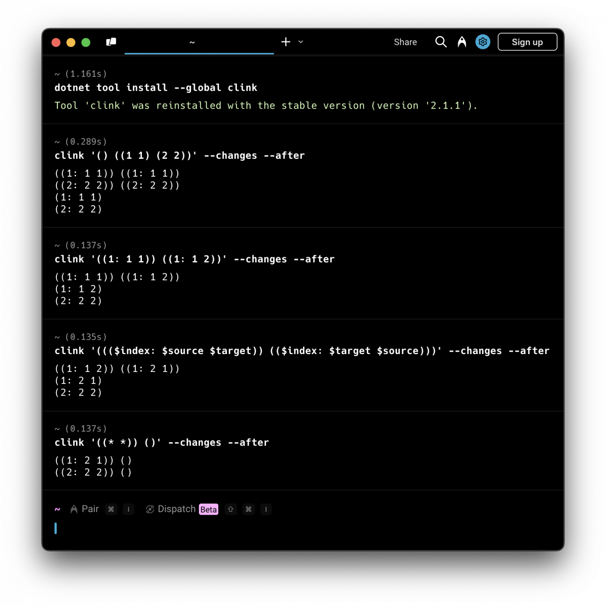

**Рис. 11.** На этом изображении вы можете видеть создание двух связей `(1: 1 1)` и `(2: 2 2)`; обновление первой связи до `(1: 1 2)`; обновление/подстановку с использованием переменных для обмена источников и приёмников каждой связи; и удаление всех связей с помощью паттерна `(* *)`.

### Визуальные демо

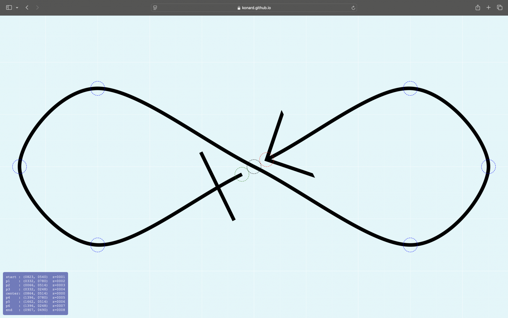

**Рис. 12.** Дизайнер чертежей связей, построенный поверх настраиваемого сплайна: [konard.github.io/links-visuals/blueprint.html](http://konard.github.io/links-visuals/blueprint.html) (перемещайте контрольные точки сплайна, представляющего связь)

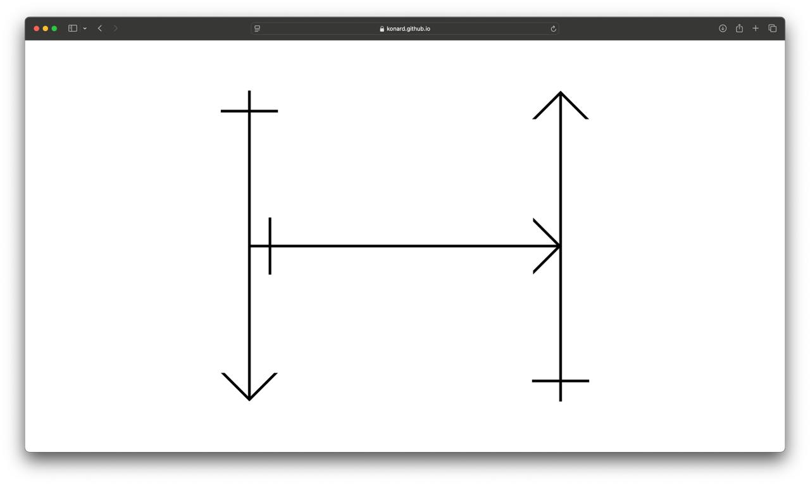

**Рис. 13.** Фрактал типа [H-дерево](https://en.wikipedia.org/wiki/H_tree), построенный с помощью связей, представленных прямыми стрелками: [konard.github.io/links-visuals/H-fractal.html](https://konard.github.io/links-visuals/H-fractal.html) (нажмите в любом месте для итерации фрактала)

### P.S.

Эта и предыдущие статьи будут обновляться по мере развития и дополнения теории связей в течение следующих 6 месяцев.

### P.S.S.

Если вы стали фанатом теории связей, предлагаем распространять в социальных сетях эту формулу как мемо-вирус.

Символами юникода:

> L ↦ L²

Используя LaTeX:

> L \to L^2

Который преобразуется в SVG (нажимается):

> $\displaystyle L \to L^2$

### Ссылки

1. Edgar F. Codd, IBM Research Laboratory, San Jose, California, June 1970, ["Relational Model of Data for Large Shared Data Banks.", paragraph 1.3., page 379](https://dl.acm.org/doi/abs/10.1145/362384.362685)
2. Bender, Edward A.; Williamson, S. Gill (2010). ["Lists, Decisions and Graphs. With an Introduction to Probability.", section 2, definition 6, page 161](https://books.google.com/books?id=vaXv_yhefG8C)
3. Simon Williams, Great Britain (1988), [The Associative Model Of Data](https://web.archive.org/web/20181219134621/http://sentences.com/docs/amd.pdf)
4. Homan, J. V., & Kovacs, P. J. (2009). [A Comparison of the Relational Database Model and the Associative Database Model](https://www.researchgate.net/publication/255670856_A_COMPARISON_OF_THE_RELATIONAL_DATABASE_MODEL_AND_THE_ASSOCIATIVE_DATABASE_MODEL). Issues in Information Systems, X(1), 208.

---

**Теги:** метатеория, теория связей, реляционная теория, ассоциативная теория, математика, теория множеств, теория типов, теория графов, реляционная алгебра, ассоциативная модель данных

**Хабы:** [Data Engineering](https://habr.com/ru/hubs/data_engineering/), [Open source](https://habr.com/ru/hubs/open_source/), [Математика](https://habr.com/ru/hubs/maths/), [Ненормальное программирование](https://habr.com/ru/hubs/crazydev/), [Программирование](https://habr.com/ru/hubs/programming/)

**Автор:** [Константин Дьяченко (Konard)](https://habr.com/ru/users/Konard/)
